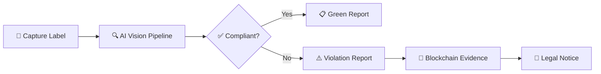
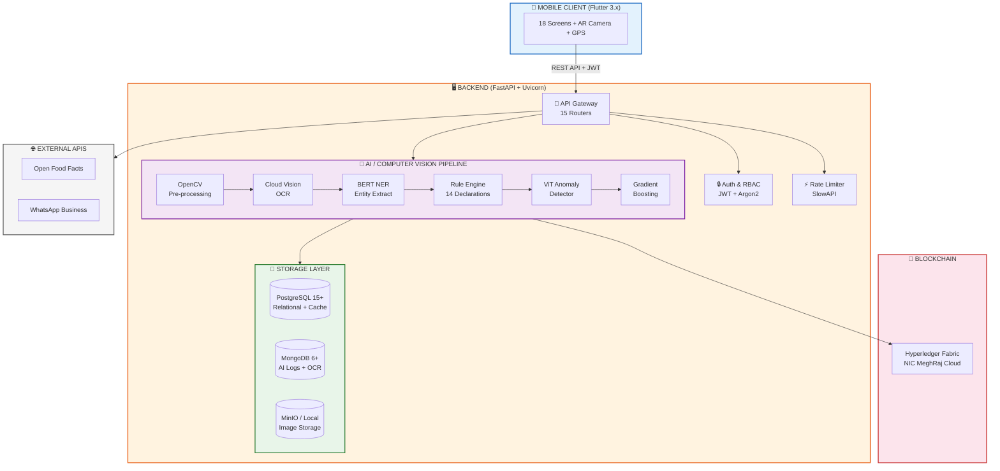
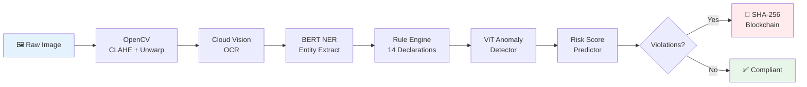
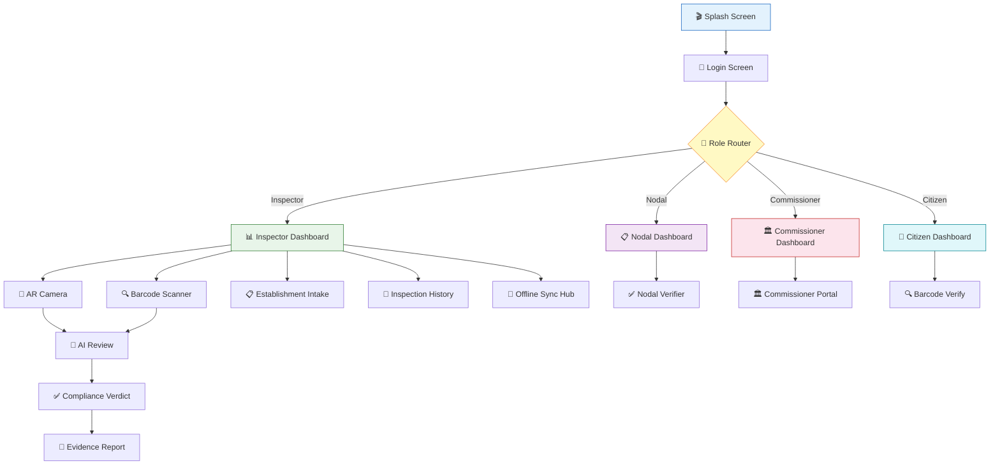
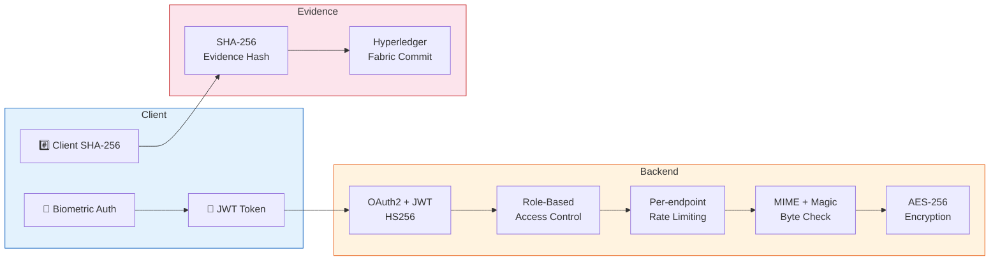

<


<br>

> An AI-powered Legal Metrology enforcement platform built for the
> **Ministry of Consumer Affairs, Food & Public Distribution (DoCA), Government of India**
>
> 🏷️ **Problem Statement ID:** `26034` &nbsp;|&nbsp; 🏆 **Smart India Hackathon**

<br>

[🚀 Quick Start](#-quick-start-guide) · [📊 API Docs](#-api-endpoints) · [🧠 AI Pipeline](#-ai--computer-vision-pipeline) · [🔐 Security](#-security-architecture) · [📄 Documentation](#-documentation-index)

</div>

---

## 🎯 What is PARAKH?

PARAKH automates product label compliance verification for enforcement officers under the **Legal Metrology Act, 2009** and the **Packaged Commodities Rules, 2011**.



A field inspector scans product packaging using a mobile device. The system then:

| Step | Action | Technology |
|:---:|---|---|
| **1** | 📸 Captures high-resolution label images via AR-guided camera | Flutter + ARCore |
| **2** | 🔤 Extracts text from packaging | Google Cloud Vision OCR |
| **3** | 🧠 Identifies manufacturer, MRP, quantity, dates, address | BERT Named Entity Recognition |
| **4** | ✅ Validates all 14 mandatory declarations against Rules 2011 | Custom Rule Engine |
| **5** | 🔍 Detects tampered labels, overprinted MRPs, anomalies | Vision Transformer (ViT) |
| **6** | 📊 Scores non-compliance risk | GradientBoosting Classifier |
| **7** | 🔗 Commits SHA-256 evidence hash to blockchain | Hyperledger Fabric |
| **8** | 📄 Generates reports in PDF, JSON, CSV | ReportLab + Crypto |

---

## ✨ Key Features

<details>
<summary><b>👮 For Inspectors</b> — Field enforcement tools</summary>

<br>

| Feature | Description |
|---|---|
| 📸 **AR-Guided Camera** | Real-time label detection with overlay boxes for guided capture |
| 🔍 **Barcode Scanner** | GS1 Modulo-10 checksum validation with live Open Food Facts registry lookup |
| 🤖 **AI Compliance Check** | One-tap full pipeline: OCR → NER → Rule Engine → Anomaly Detection |
| 📋 **Establishment Intake** | Structured form for capturing establishment details, GPS coordinates, photos |
| 📄 **Report Generation** | Multi-format export (PDF with digital signature, JSON, CSV) |
| 🔗 **Blockchain Evidence** | SHA-256 evidence hash committed to Hyperledger Fabric |
| 📶 **Offline Mode** | Full functionality with local database; auto-sync when connectivity resumes |
| 📊 **Inspection History** | Searchable repository of all scanned products and past inspections |

</details>

<details>
<summary><b>🏢 For Nodal Officers</b> — Verification & oversight</summary>

<br>

| Feature | Description |
|---|---|
| 🗺️ **Violation Heatmaps** | Geographic cluster visualization of non-compliance hotspots |
| ✅ **Verification Queue** | Review, approve, or return inspector-submitted evidence |
| 📈 **Analytics Dashboard** | Real-time metrics on inspection volume, compliance rates, pending cases |

</details>

<details>
<summary><b>🏛️ For Commissioners</b> — State-wide administration</summary>

<br>

| Feature | Description |
|---|---|
| 🏢 **State-Wide Analytics** | Aggregated statistics across all districts and nodal offices |
| 📜 **Legal Notice Generation** | Automated PDF legal notices with pre-filled violation details |
| 🔍 **Audit Trail** | Complete system audit log with timestamp, actor, and action details |

</details>

<details>
<summary><b>👤 For Citizens</b> — Consumer protection</summary>

<br>

| Feature | Description |
|---|---|
| 📱 **Consumer Portal** | Scan barcodes to verify product authenticity |
| 📝 **Complaint Filing** | Submit complaints with photo evidence |
| 💬 **WhatsApp Integration** | Report violations via WhatsApp Business API |

</details>

---

## 🧩 System Architecture



---

## 🧠 AI / Computer Vision Pipeline

The backend processes each product image through a **six-stage pipeline**:



<details>
<summary><b>📋 Pipeline Stage Details</b></summary>

<br>

| Stage | Module | Technology | Purpose |
|:---:|--------|-----------|---------|
| 1 | `ai/image_processor.py` | OpenCV 4.x | CLAHE contrast enhancement, 3D unwarping, contour detection, rotation correction |
| 2 | `ai/ocr_engine.py` | Google Cloud Vision API | Full-text extraction with word-level bounding boxes and confidence scores |
| 3 | `ai/nlp_extractor.py` | `dslim/bert-base-NER` | Named-entity recognition: manufacturer, address, quantity, MRP, dates |
| 4 | `rules/engine.py` | Custom Rule Engine | Validates all 14 mandatory declarations under PCR 2011 |
| 5 | `ai/anomaly_detector.py` | `google/vit-base-patch16-224` | Detects tampered labels, overprinted MRPs, missing fields |
| 6 | `ai/predictive.py` | `GradientBoostingClassifier` | Scores products on non-compliance probability |

**Additional modules:**
- **AI Triage** (`ai/ai_triage.py`) — prioritizes inspection queue based on risk scores
- **Evidence Hashing** — SHA-256 digest of `image_bytes + GPS + timestamp + OCR_text + violations`

</details>

---

## 🛠️ Technology Stack

<table>
<tr><th>Layer</th><th>Technology</th><th>Purpose</th></tr>
<tr><td>📱 <b>Mobile</b></td><td>Flutter 3.x + ARCore/ARKit</td><td>Cross-platform mobile with AR overlay</td></tr>
<tr><td>🔄 <b>State</b></td><td>Provider Pattern</td><td>Reactive state management</td></tr>
<tr><td>⚡ <b>Backend</b></td><td>Python 3.11+ / FastAPI / Uvicorn</td><td>Async REST API server</td></tr>
<tr><td>🔤 <b>OCR</b></td><td>Google Cloud Vision API</td><td>Cloud-native text extraction</td></tr>
<tr><td>🧠 <b>NLP</b></td><td>HuggingFace <code>dslim/bert-base-NER</code></td><td>Named-entity recognition</td></tr>
<tr><td>🖼️ <b>Vision</b></td><td>OpenCV 4.x</td><td>Image pre-processing & enhancement</td></tr>
<tr><td>🔍 <b>Anomaly</b></td><td>HuggingFace ViT</td><td>Visual anomaly detection</td></tr>
<tr><td>📊 <b>Analytics</b></td><td>scikit-learn</td><td>Risk scoring & prediction</td></tr>
<tr><td>🗄️ <b>SQL DB</b></td><td>PostgreSQL 15+ (asyncpg)</td><td>Primary relational store</td></tr>
<tr><td>📦 <b>Cache</b></td><td>PostgreSQL-native</td><td>Zero-dependency caching (no Redis)</td></tr>
<tr><td>📝 <b>NoSQL</b></td><td>MongoDB 6+ (Motor)</td><td>Raw OCR dumps & AI audit logs</td></tr>
<tr><td>🗂️ <b>Storage</b></td><td>MinIO / Local FS</td><td>Image & evidence file storage</td></tr>
<tr><td>🔗 <b>Blockchain</b></td><td>Hyperledger Fabric</td><td>Tamper-proof evidence ledger</td></tr>
<tr><td>🌐 <b>External</b></td><td>Open Food Facts API</td><td>Product registry verification</td></tr>
<tr><td>💬 <b>Messaging</b></td><td>WhatsApp Business API</td><td>Citizen complaint channel</td></tr>
<tr><td>🔒 <b>Auth</b></td><td>JWT (HS256) + Argon2</td><td>Token-based authentication</td></tr>
<tr><td>⚡ <b>Rate Limit</b></td><td>SlowAPI</td><td>Per-endpoint request throttling</td></tr>
</table>

---

## 📁 Project Structure

<details>
<summary><b>📂 Click to expand full project tree</b></summary>

```
T1/
├── README.md                           # ← You are here
├── .gitignore
├── analysis_options.yaml               # Dart lint rules
│
├── backend/                            # 🖥️ Python FastAPI Backend
│   ├── README.md                       # Backend-specific documentation
│   ├── app/
│   │   ├── main.py                     # Application entry point (Uvicorn)
│   │   ├── config.py                   # Settings (Pydantic BaseSettings)
│   │   ├── ai/                         # 🧠 AI / Computer Vision Pipeline
│   │   │   ├── image_processor.py      #   OpenCV: CLAHE, unwarping, contours
│   │   │   ├── ocr_engine.py           #   Google Cloud Vision OCR
│   │   │   ├── nlp_extractor.py        #   BERT NER entity extraction
│   │   │   ├── anomaly_detector.py     #   ViT anomaly detection
│   │   │   ├── predictive.py           #   GradientBoosting risk scoring
│   │   │   └── ai_triage.py            #   Inspection queue prioritization
│   │   ├── api/v1/                     # 🔌 15 Versioned API Routers
│   │   │   ├── router.py              #   Master router
│   │   │   ├── auth.py                #   Login, register, token refresh
│   │   │   ├── users.py              #   User profile CRUD
│   │   │   ├── scan.py               #   Image upload & barcode lookup
│   │   │   ├── analysis.py           #   Full AI compliance pipeline
│   │   │   ├── inspections.py        #   Inspection CRUD + report export
│   │   │   ├── compliance.py         #   Rule engine results
│   │   │   ├── evidence.py           #   Blockchain evidence commit/verify
│   │   │   ├── citizen.py            #   Citizen complaints & WhatsApp
│   │   │   ├── analytics.py          #   Dashboard statistics
│   │   │   ├── heatmaps.py           #   Geographic violation clusters
│   │   │   ├── legal_notices.py      #   PDF legal notice generation
│   │   │   ├── audit.py              #   System audit trail
│   │   │   ├── sync.py               #   Offline data synchronization
│   │   │   └── health.py             #   Liveness & readiness probes
│   │   ├── analytics/                  # 📊 Analytics aggregation
│   │   ├── audit/                      # 📋 Audit trail service
│   │   ├── blockchain/                 # 🔗 Hyperledger Fabric client
│   │   ├── core/                       # 🔒 Security, RBAC, rate limiter
│   │   ├── db/                         # 🗄️ PostgreSQL & MongoDB connectors
│   │   ├── integrations/               # 🌐 Open Food Facts, WhatsApp
│   │   ├── models/                     # 📝 SQLAlchemy ORM models
│   │   ├── repositories/              # 📂 Data access layer
│   │   ├── rules/                      # ⚖️ Legal Metrology rule engine
│   │   ├── schemas/                    # 📋 Pydantic schemas
│   │   ├── security/                   # 🔐 Password hashing, JWT, encryption
│   │   ├── services/                   # ⚙️ Business logic layer
│   │   └── storage/                    # 🗂️ MinIO & local file storage
│   ├── tests/                          # 🧪 37 Unit & integration tests
│   ├── requirements.txt
│   └── .env.example
│
├── frontend/                           # 📱 Flutter Mobile Application
│   ├── README.md                       # Frontend-specific documentation
│   ├── lib/
│   │   ├── main.dart                   # App entry point & route definitions
│   │   ├── core/                       # 🎨 Foundation Layer
│   │   │   ├── theme.dart              #   Material 3 design system
│   │   │   ├── api_client.dart         #   HTTP client with JWT interceptor
│   │   │   ├── constants.dart          #   API URLs, app constants
│   │   │   ├── role_guard.dart         #   RBAC UI gatekeeper
│   │   │   └── storage_service.dart    #   Secure storage wrapper
│   │   ├── models/                     # 📋 Dart data models
│   │   ├── providers/                  # 🔄 State management (Provider)
│   │   ├── screens/                    # 📱 18 Application Screens
│   │   └── widgets/                    # 🧩 6 Reusable UI Components
│   ├── assets/                         # 🎨 Logo, splash video
│   ├── android/ & ios/                 # Platform configs
│   └── pubspec.yaml
│
└── tools/                              # 📚 Documentation & Resources
    ├── LEGAL_METROLOGY_COMPLIANCE_CHECKLIST.md
    ├── USER_TYPES_AND_ROLES.md
    ├── INSTRUCTIONS.md
    ├── DEVICE_CONNECTIVITY_GUIDE.md
    ├── Project_PARAKH_*.md             # 9 Architecture documents
    ├── legal_metrology_rules_2011.json # Machine-readable rules DB
    ├── connect_device.ps1 / .bat       # Device connection scripts
    └── splash_video.mp4                # Splash animation
```

</details>

---

## 📱 Mobile App — Screens & Navigation

The Flutter application contains **18 screens** with role-based routing:



<details>
<summary><b>📋 All 18 Screens — Detailed</b></summary>

<br>

#### Common Screens
| Screen | File | Description |
|--------|------|-------------|
| 🎬 Splash | `splash_screen.dart` | Animated logo + video splash with auto-navigation |
| 🔑 Login | `login_screen.dart` | Biometric + credential authentication with role selection |
| ⚙️ Profile | `profile_settings_screen.dart` | User profile, preferences, and logout |

#### Inspector Screens
| Screen | File | Description |
|--------|------|-------------|
| 📊 Dashboard | `inspector_dashboard_screen.dart` | Metrics, violations, pending sync, quick-action tiles |
| 📸 AR Camera | `ar_camera_screen.dart` | ARCore/ARKit guided camera with real-time bounding boxes |
| 🔍 Barcode Scanner | `barcode_scanner_screen.dart` | GS1 scan + Open Food Facts + manual GTIN entry |
| 🤖 AI Review | `ai_review_screen.dart` | Side-by-side: original image ↔ AI extracted fields |
| ✅ Compliance Verdict | `compliance_verdict_screen.dart` | Pass/Fail with per-declaration breakdown |
| 📄 Evidence Report | `evidence_report_screen.dart` | PDF/JSON/CSV export with blockchain hash |
| 📋 Establishment Intake | `establishment_intake_screen.dart` | Establishment data form + GPS auto-fill |
| 📜 Inspection History | `inspection_history_screen.dart` | Searchable, filterable past inspections |
| 📶 Offline Sync | `offline_sync_hub_screen.dart` | Pending uploads, manual sync, conflict resolution |

#### Nodal Officer Screens
| Screen | File | Description |
|--------|------|-------------|
| 📋 Nodal Dashboard | `nodal_dashboard_screen.dart` | District-level metrics, compliance trends |
| ✅ Nodal Verifier | `nodal_verifier_screen.dart` | Review evidence, approve/reject/return |

#### Commissioner Screens
| Screen | File | Description |
|--------|------|-------------|
| 🏛️ Commissioner Dashboard | `commissioner_dashboard_screen.dart` | State-wide analytics, district comparison |
| 🏛️ Commissioner Portal | `commissioner_portal_screen.dart` | Legal notices, audit trail, policy management |

#### Citizen Screens
| Screen | File | Description |
|--------|------|-------------|
| 👤 Citizen Dashboard | `citizen_dashboard_screen.dart` | Barcode verify, file complaints, track status |

</details>

---

## 🚀 Quick Start Guide

### Prerequisites

| Requirement | Version | Required |
|:---:|:---:|:---:|
|  | 3.11+ | ✅ |
|  | 3.x | ✅ |
|  | 15+ | ✅ |
|  | 6+ | ✅ |
|  | Latest | Optional |
| Google Cloud Vision API Key | — | Optional |

### 1. Clone the Repository

```bash
git clone https://github.com/jitendrachoudhary1401-hue/Parakh.git
cd Parakh/models/T1
```

### 2. Backend Setup

```bash
cd backend
python -m venv venv
source venv/bin/activate          # Linux/macOS
# venv\Scripts\activate           # Windows
pip install -r requirements.txt
cp .env.example .env              # ⚠️ Edit with your credentials
uvicorn app.main:app --host 0.0.0.0 --port 8000 --reload
```

> 📖 **Detailed backend setup** → [`backend/README.md`](backend/README.md)

### 3. Mobile App Setup

```bash
cd frontend
flutter pub get
flutter run
```

> 📖 **Detailed frontend setup** → [`frontend/README.md`](frontend/README.md)

### 4. Connect Mobile to Backend

Update `frontend/lib/core/constants.dart`:

```dart
static const String apiBaseUrl = 'http://<YOUR_IP>:8000/api/v1';
// Android emulator: use 10.0.2.2
```

---

## ⚙️ Environment Variables

> Full reference in [`backend/.env.example`](backend/.env.example) — 50+ configurable variables.

<details>
<summary><b>🔧 Core Settings</b></summary>

| Variable | Default | Description |
|---|---|---|
| `APP_ENV` | `development` | Environment mode |
| `DEBUG` | `true` | Debug toggle |
| `HOST` | `0.0.0.0` | Server bind address |
| `PORT` | `8000` | Server port |
| `WORKERS` | `4` | Uvicorn worker count |

</details>

<details>
<summary><b>🗄️ Database</b></summary>

| Variable | Default | Description |
|---|---|---|
| `DATABASE_URL` | — | PostgreSQL async connection (asyncpg) |
| `DATABASE_URL_SYNC` | — | PostgreSQL sync connection (Alembic) |
| `DB_POOL_SIZE` | `20` | Connection pool size |
| `MONGODB_URL` | `mongodb://localhost:27017` | MongoDB connection |
| `MONGODB_DATABASE` | `parakh_db` | MongoDB database name |

</details>

<details>
<summary><b>🔒 Authentication & Security</b></summary>

| Variable | Default | Description |
|---|---|---|
| `JWT_SECRET_KEY` | — | ⚠️ **MUST CHANGE** — JWT signing secret |
| `JWT_ALGORITHM` | `HS256` | JWT algorithm |
| `JWT_ACCESS_TOKEN_EXPIRE_MINUTES` | `30` | Access token TTL |
| `ENCRYPTION_KEY` | — | ⚠️ **MUST CHANGE** — AES-256 key |

</details>

<details>
<summary><b>🧠 AI / ML Models</b></summary>

| Variable | Default | Description |
|---|---|---|
| `NER_MODEL_NAME` | `dslim/bert-base-NER` | HuggingFace NER model |
| `VIT_MODEL_NAME` | `google/vit-base-patch16-224` | ViT anomaly model |
| `NER_CONFIDENCE_THRESHOLD` | `0.5` | Minimum NER confidence |
| `ANOMALY_DETECTION_ENABLED` | `true` | Enable ViT detection |

</details>

<details>
<summary><b>🌐 External Services</b></summary>

| Variable | Default | Description |
|---|---|---|
| `GOOGLE_CLOUD_VISION_KEY` | — | Google Vision API key |
| `OPENFOODFACTS_API_URL` | `https://world.openfoodfacts.org/api/v2` | Product registry |
| `WHATSAPP_ENABLED` | `false` | WhatsApp Business |
| `BLOCKCHAIN_ENABLED` | `false` | Hyperledger Fabric |

</details>

<details>
<summary><b>⚡ Rate Limiting</b></summary>

| Variable | Default | Description |
|---|---|---|
| `RATE_LIMIT_LOGIN` | `5/minute` | Login throttle |
| `RATE_LIMIT_UPLOAD` | `20/minute` | Upload throttle |
| `RATE_LIMIT_ANALYSIS` | `10/minute` | AI analysis throttle |
| `RATE_LIMIT_DEFAULT` | `60/minute` | Default throttle |

</details>

---

## 📊 API Endpoints

> 📖 **Interactive documentation:** `http://localhost:8000/docs` (Swagger UI)

All endpoints prefixed with `/api/v1`:

<details>
<summary><b>🏥 Health & System</b></summary>

| Method | Endpoint | Auth | Description |
|:---:|---|:---:|---|
| `GET` | `/health` | — | Liveness probe |
| `GET` | `/ready` | — | Readiness probe (DB check) |

</details>

<details>
<summary><b>🔑 Authentication</b></summary>

| Method | Endpoint | Auth | Description |
|:---:|---|:---:|---|
| `POST` | `/auth/login` | — | JWT login (access + refresh tokens) |
| `POST` | `/auth/register` | — | User registration |

</details>

<details>
<summary><b>👤 Users</b></summary>

| Method | Endpoint | Auth | Description |
|:---:|---|:---:|---|
| `GET` | `/users/me` | JWT | Current user profile |
| `PUT` | `/users/{id}` | JWT | Update user profile |

</details>

<details>
<summary><b>📸 Scanning & Processing</b></summary>

| Method | Endpoint | Auth | Description |
|:---:|---|:---:|---|
| `POST` | `/scan/upload` | JWT | Upload product image |
| `POST` | `/scan/process` | JWT | Trigger AI pipeline |
| `GET` | `/scan/barcode/{gtin}` | — | Public barcode lookup (rate-limited) |

</details>

<details>
<summary><b>🤖 Analysis & Compliance</b></summary>

| Method | Endpoint | Auth | Description |
|:---:|---|:---:|---|
| `POST` | `/analysis/{id}/verify` | JWT | Run full compliance pipeline |
| `GET` | `/compliance/{id}` | JWT | Get rule engine results |

</details>

<details>
<summary><b>📋 Inspections</b></summary>

| Method | Endpoint | Auth | Description |
|:---:|---|:---:|---|
| `GET` | `/inspections` | JWT | List inspections (paginated) |
| `POST` | `/inspections` | JWT | Create new inspection |
| `GET` | `/inspections/{id}/export/pdf` | JWT | Export as PDF |
| `GET` | `/inspections/{id}/export/json` | JWT | Export as JSON |
| `GET` | `/inspections/{id}/export/csv` | JWT | Export as CSV |

</details>

<details>
<summary><b>🔗 Evidence & Blockchain</b></summary>

| Method | Endpoint | Auth | Description |
|:---:|---|:---:|---|
| `POST` | `/evidence/commit` | JWT | Commit evidence to blockchain |
| `GET` | `/evidence/verify` | JWT | Verify evidence integrity |

</details>

<details>
<summary><b>👤 Citizen Portal</b></summary>

| Method | Endpoint | Auth | Description |
|:---:|---|:---:|---|
| `POST` | `/citizen/report` | JWT | Submit citizen complaint |
| `POST` | `/citizen/whatsapp` | — | WhatsApp webhook |

</details>

<details>
<summary><b>📊 Analytics & Reporting</b></summary>

| Method | Endpoint | Auth | Description |
|:---:|---|:---:|---|
| `GET` | `/analytics/summary` | JWT | Dashboard analytics |
| `GET` | `/heatmaps` | JWT | Violation heatmaps |
| `POST` | `/legal-notices/generate` | JWT | Generate legal notice |
| `GET` | `/audit/logs` | JWT (Admin) | Audit trail |
| `POST` | `/sync/push` | JWT | Push offline records |
| `GET` | `/sync/pull` | JWT | Pull latest records |

</details>

---

## 🔐 Security Architecture



<details>
<summary><b>🔒 Security Details</b></summary>

| Layer | Implementation |
|---|---|
| **Authentication** | OAuth2-compliant JWT (HS256) with configurable access/refresh token TTLs |
| **Password Hashing** | Argon2 (primary) with BCrypt fallback |
| **Biometrics** | Fingerprint/Face ID on mobile via `local_auth` |
| **Authorization** | `RoleGuard` (frontend) + `deps.py` (backend) enforce 4-role RBAC |
| **Encryption** | AES-256 for sensitive data at rest |
| **Evidence Integrity** | SHA-256 hash committed to Hyperledger Fabric |
| **File Validation** | MIME-type + magic-byte check, max 25 MB |
| **Rate Limiting** | SlowAPI per-endpoint throttling (login: 5/min, upload: 20/min) |

</details>

---

## 👥 Roles & Permissions (RBAC)

| Feature | 👮 Inspector | 🏢 Nodal | 🏛️ Commissioner | 👤 Citizen |
|---|:---:|:---:|:---:|:---:|
| Scan Products (Camera/AR) | ✅ | ❌ | ❌ | ❌ |
| Barcode Lookup | ✅ | ✅ | ✅ | ✅ |
| AI Compliance Check | ✅ | ❌ | ❌ | ❌ |
| Submit Evidence | ✅ | ❌ | ❌ | ❌ |
| Establishment Intake | ✅ | ❌ | ❌ | ❌ |
| Generate Reports | ✅ | ✅ | ✅ | ❌ |
| Inspection History | ✅ | ✅ | ✅ | ❌ |
| Verify/Approve Evidence | ❌ | ✅ | ✅ | ❌ |
| District Analytics | ❌ | ✅ | ✅ | ❌ |
| State-Wide Analytics | ❌ | ❌ | ✅ | ❌ |
| Generate Legal Notices | ❌ | ❌ | ✅ | ❌ |
| Audit Trail | ❌ | ❌ | ✅ | ❌ |
| File Complaints | ❌ | ❌ | ❌ | ✅ |
| WhatsApp Reporting | ❌ | ❌ | ❌ | ✅ |
| Offline Sync | ✅ | ❌ | ❌ | ❌ |

> 📖 Full RBAC matrix → [`tools/USER_TYPES_AND_ROLES.md`](tools/USER_TYPES_AND_ROLES.md)

---

## 📜 Legal & Regulatory Framework

| Legislation | Relevance |
|---|---|
| 📜 **Legal Metrology Act, 2009** | Primary governing statute for weights & measures |
| 📦 **Packaged Commodities Rules, 2011** (Amd. 2017) | 14 mandatory declarations on pre-packaged goods |
| ⚖️ **Section 65B, Indian Evidence Act** | Electronic evidence admissibility in court |
| 🔐 **IT Act, 2000** | Digital signature and data protection |
| 🛡️ **Consumer Protection Act, 2019** | Citizen complaint handling framework |
| 📏 **BIS Standards (IS 15778, IS 14543)** | Unit of measurement & date format standards |

> 📖 Full compliance checklist → [`tools/LEGAL_METROLOGY_COMPLIANCE_CHECKLIST.md`](tools/LEGAL_METROLOGY_COMPLIANCE_CHECKLIST.md)

---

## 🚢 Deployment

<details>
<summary><b>🖥️ Development (Local)</b></summary>

```bash
# Terminal 1: Backend
cd backend && uvicorn app.main:app --reload --port 8000

# Terminal 2: Mobile App
cd frontend && flutter run
```

</details>

<details>
<summary><b>🐳 Docker</b></summary>

```bash
# Backend
docker build -t parakh-backend ./backend
docker run -d --name parakh-api -p 8000:8000 --env-file backend/.env parakh-backend

# MinIO (Object Storage)
docker run -d --name parakh-minio -p 9000:9000 -p 9001:9001 \
  -e MINIO_ROOT_USER=minioadmin -e MINIO_ROOT_PASSWORD=minioadmin \
  minio/minio server /data --console-address ":9001"
```

</details>

<details>
<summary><b>🏛️ NIC MeghRaj (Government Cloud)</b></summary>

1. Provision VM on NIC MeghRaj portal
2. Install PostgreSQL 15+ and MongoDB 6+ on separate instances
3. Deploy backend behind NIC's load balancer
4. Connect to NIC's Hyperledger Fabric network
5. Submit APK to Government App Store

</details>

<details>
<summary><b>✅ Production Checklist</b></summary>

- [ ] Set `APP_ENV=production` and `DEBUG=false`
- [ ] Generate strong `JWT_SECRET_KEY` and `ENCRYPTION_KEY`
- [ ] Configure PostgreSQL with SSL and PgBouncer
- [ ] Enable `BLOCKCHAIN_ENABLED=true` with credentials
- [ ] Configure MinIO with replication
- [ ] Set up HTTPS reverse proxy (Nginx/Traefik)
- [ ] Enable `AUDIT_LOG_ENABLED=true`
- [ ] Configure rate limits for expected load
- [ ] Build release APK: `flutter build apk --release`

</details>

---

## 📄 Documentation Index

<details>
<summary><b>📜 Regulatory & Compliance</b></summary>

| Document | Description |
|---|---|
| [📋 Compliance Checklist](tools/LEGAL_METROLOGY_COMPLIANCE_CHECKLIST.md) | PCR 2011 checklist with Schedule I/II tables |
| [👥 User Types & Roles](tools/USER_TYPES_AND_ROLES.md) | Complete RBAC matrix & segregation of duties |
| [⚖️ Legal Metrology Rules](tools/Project_PARAKH_Legal_Metrology_Rules.md) | Detailed rule definitions & penalty framework |
| [🔧 Advanced Features](tools/Advanced_Legal_Metrology_Features.md) | Extended compliance & edge-case handling |

</details>

<details>
<summary><b>🏗️ Technical Architecture</b></summary>

| Document | Description |
|---|---|
| [🧠 AI Architecture](tools/Project_PARAKH_AI_Architecture.md) | AI/ML pipeline design & model selection rationale |
| [🤖 AI Models](tools/Project_PARAKH_AI_Models.md) | Model specs, training data, benchmarks |
| [🏛️ System Architecture](tools/Project_PARAKH_Architecture.md) | Backend architecture & data flow |
| [🔌 API Gateway](tools/Project_PARAKH_API_Gateway.md) | Gateway config & routing logic |
| [🔐 Security Layer](tools/Project_PARAKH_Security_Layer.md) | Security architecture & threat model |
| [🛠️ Tech Stack](tools/Project_PARAKH_TechStack.md) | Technology decisions & rationale |

</details>

<details>
<summary><b>📚 Product & Integration</b></summary>

| Document | Description |
|---|---|
| [📋 PRD](tools/Project_PARAKH_PRD.md) | Product Requirements Document |
| [📖 API Documentation](tools/Project_PARAKH_Documentation.md) | API reference & integration guide |
| [📱 Mobile App Pages](tools/Project_PARAKH_Mobile_App_Pages.md) | Screen inventory & navigation map |
| [📡 Device Connectivity](tools/DEVICE_CONNECTIVITY_GUIDE.md) | Android/iOS device connection guide |
| [⚙️ Setup Instructions](tools/INSTRUCTIONS.md) | Detailed setup & configuration |

</details>

---

## 🤝 Contributing

1. **Fork** the repository
2. **Create** a feature branch: `git checkout -b feature/my-feature`
3. **Commit** your changes: `git commit -m 'Add my feature'`
4. **Push** to the branch: `git push origin feature/my-feature`
5. **Open** a Pull Request

---

## 📝 License

This project is developed for the **Government of India** under the Smart India Hackathon initiative. All rights reserved under applicable government licensing terms.

---

<div align="center">

**🏛️ Project PARAKH** — *Protecting Consumers. Empowering Enforcement. Powered by AI.*

Ministry of Consumer Affairs, Food & Public Distribution (DoCA) | Government of India

<br>


</div>
]]>
