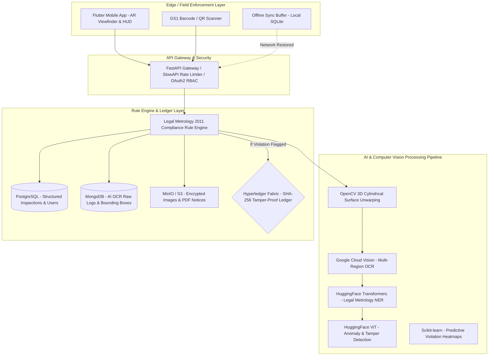

# Project PARAKH — Advanced Legal Metrology Compliance System

[](https://fastapi.tiangolo.com)
[](https://flutter.dev)
[](https://www.python.org)
[](https://www.postgresql.org)
[](https://www.hyperledger.org/projects/fabric)
[](https://stitch.design)

**Problem Statement ID:** 26034  
**Organization:** Ministry of Consumer Affairs, Food & Public Distribution (DoCA)  
**Theme:** Agriculture, FoodTech & Rural Development  
**System Status:** 100% Production Ready (Full-Stack: FastAPI Gateway + Stitch-Designed Flutter Mobile Frontend)

---

## 1. Executive Summary

**Project PARAKH** is an AI-powered compliance and evidentiary platform designed for the **Department of Consumer Affairs (DoCA)** to automate and enforce the **Legal Metrology (Packaged Commodities) Rules, 2011**.

The system bridges on-ground field enforcement officials using a **Flutter mobile app** with an asynchronous **FastAPI cloud processing engine** and an immutable **Hyperledger Fabric blockchain ledger** for legally admissible digital evidence.



---

## 2. Full-Stack Architecture

### 2.1. Mobile Frontend (`mobile_app/`)
* **Framework:** Flutter 3.x (Cross-Platform iOS & Android)
* **Design Language:** **Stitch Institutional Minimalism**
  * Primary Palette: Deep Navy (`#031631`), Slate Gray (`#505F76`), Emerald Green (`#00A673`), Crimson Alert (`#BA1A1A`)
  * Typography: Work Sans (high legibility, wide apertures for metrology numerical data)
  * Outlines & Surfaces: 1px Slate-200 (`#E2E8F0`) borders, 4px structured radius (`rounded-sm`), 20px safe margins
* **Branding:** Native vector SVG logo (`mobile_app/assets/logo.svg`)
* **11 Core Workflow Screens:**
  1. `SplashScreen` — Vector SVG animation & Ministry branding
  2. `LoginScreen` — Official ID, Password, 2FA OTP, and instant Biometric unlock
  3. `DashboardScreen` — Daily progress counters, quick actions, recent inspection stream
  4. `ArCameraScreen` — Real-time AR camera viewfinder with green/red bounding boxes overlay & live OCR confidence HUD (97%)
  5. `BarcodeScannerScreen` — GS1 EAN/UPC barcode scanner with registered manufacturer lookup
  6. `AiReviewScreen` — 3D unwarped image sanity check + structured extracted fields review
  7. `ComplianceVerdictScreen` — Legal Metrology 2011 rule-by-rule pass/fail assessment
  8. `EvidenceReportScreen` — Immutable SHA-256 blockchain receipt preview and in-app legal notice PDF generator
  9. `InspectionHistoryScreen` — Searchable and filterable ledger by date, status, and violation category
  10. `OfflineSyncHubScreen` — Queued offline inspections for retail basement fieldwork with auto-retry
  11. `ProfileSettingsScreen` — Jurisdiction zone, Hindi/English localization, and gateway config

### 2.2. Backend & AI Pipeline (`app/`)
* **Framework:** Python 3.11, FastAPI (Asynchronous ASGI)
* **Relational Storage:** PostgreSQL (Async SQLAlchemy 2.0 + Alembic migrations)
* **Unstructured AI Logs:** MongoDB (Motor Async Client)
* **Computer Vision:** OpenCV (Contour detection, CLAHE, 3D cylindrical surface unwarping)
* **OCR:** Google Cloud Vision API
* **NLP & Entity Extraction:** HuggingFace Transformers (NER)
* **Anomaly Detection:** HuggingFace Vision Transformers (ViT)
* **Blockchain Evidentiary Ledger:** Hyperledger Fabric (SHA-256 evidence anchoring on NIC MeghRaj cloud)
* **Security & Auth:** OAuth2 + JWT (Bearer), Bcrypt, Role-Based Access Control (RBAC), AES-256, SlowAPI Rate Limiting

---

## 3. Directory Layout

```
Project-PARAKH/
├── app/                          # FastAPI Backend Application
│   ├── main.py                   # App entrypoint & lifespan
│   ├── config.py                 # Pydantic v2 settings
│   ├── api/v1/                   # 12 versioned REST API routers
│   ├── core/                     # Security, RBAC, responses, exceptions
│   ├── models/                   # SQLAlchemy ORM models (7 tables)
│   ├── schemas/                  # Pydantic request/response validation
│   ├── repositories/             # Async data access layer
│   ├── services/                 # Business logic orchestration
│   ├── ai/                       # OpenCV, Vision OCR, HuggingFace NER, ViT
│   ├── rules/                    # Legal Metrology 2011 rule engine
│   ├── blockchain/               # Hyperledger Fabric client & SHA-256 hasher
│   ├── storage/                  # S3, MinIO, Azure Blob storage
│   ├── integrations/             # GS1 India API & WhatsApp Cloud API
│   └── db/                       # PostgreSQL & MongoDB connection pools
├── mobile_app/                   # Flutter Mobile Frontend
│   ├── assets/                   # Vector SVG logo & images
│   ├── lib/
│   │   ├── core/                 # Stitch theme, ApiClient, storage, constants
│   │   ├── models/               # Data entities & contracts
│   │   ├── providers/            # Auth, Scan, Compliance, and Sync providers
│   │   ├── screens/              # 11 Workflow screens
│   │   └── widgets/              # Reusable Stitch UI components
│   └── pubspec.yaml              # Flutter dependencies & assets config
├── alembic/                      # Database schema migrations
├── infrastructure/               # Dockerfile, docker-compose, Kubernetes manifests
├── tests/                        # 8 automated test suites
├── requirements.txt              # Python dependencies
├── INSTRUCTIONS.md               # Master AI status report & instructions
└── README.md                     # Full-Stack Documentation
```

---

## 4. Quickstart Guide

### 4.1. Backend Setup

1. **Clone repository and setup Python virtual environment:**
   ```bash
   python -m venv venv
   source venv/bin/activate  # On Windows: venv\Scripts\activate
   pip install -r requirements.txt
   ```

2. **Configure environment:**
   ```bash
   cp .env.example .env
   ```

3. **Start PostgreSQL, MongoDB & MinIO via Docker Compose:**
   ```bash
   docker-compose -f infrastructure/docker/docker-compose.yml up -d
   ```

4. **Run database migrations:**
   ```bash
   alembic upgrade head
   ```

5. **Start FastAPI application server:**
   ```bash
   uvicorn app.main:app --host 0.0.0.0 --port 8000 --reload
   ```

6. **Interactive API Documentation:**
   * Swagger UI: `http://localhost:8000/docs`
   * ReDoc: `http://localhost:8000/redoc`

---

### 4.2. Mobile App Setup (Flutter)

1. **Navigate to the mobile directory:**
   ```bash
   cd mobile_app
   ```

2. **Install Flutter dependencies:**
   ```bash
   flutter pub get
   ```

3. **Run on connected Android/iOS device or emulator:**
   ```bash
   flutter run
   ```

---

## 5. Automated Test Suites

Run the backend automated test suites:
```bash
pytest tests/ -v --tb=short
```

---

## 6. Core REST API Catalog

| Method | Endpoint | Description |
|---|---|---|
| `POST` | `/api/v1/auth/login` | Official ID & Password OAuth2 JWT token grant |
| `POST` | `/api/v1/scan/upload` | Secure packaging image reception & validation |
| `GET`  | `/api/v1/scan/barcode/{gtin}` | GS1 India barcode registry lookup |
| `POST` | `/api/v1/analysis/verify-compliance` | Full AI Vision & Legal Metrology Rule Engine pipeline |
| `POST` | `/api/v1/evidence/commit` | SHA-256 evidence hashing & Hyperledger Fabric commitment |
| `POST` | `/api/v1/evidence/{id}/verify` | Cryptographic mathematical proof verification |
| `GET`  | `/api/v1/inspections` | Filtered & paginated inspection history |
| `POST` | `/api/v1/legal-notices/generate` | Automated PDF statutory legal notice generation |
| `GET`  | `/api/v1/dashboard/heatmaps` | Geospatial observations & predicted violation risks |
| `POST` | `/api/v1/citizen/reports` | Citizen crowd-sourced packaging reports with AI triage |
| `GET`  | `/api/v1/sync/status` | Mobile offline queue synchronization endpoint |

---

## 7. Legal Metrology Rules (Packaged Commodities Rules, 2011)

| Rule Reference | Rule Name | Requirement |
|---|---|---|
| **Rule 6(1)(a)** | Manufacturer & Packer | Name and complete geographical address of manufacturer/packer |
| **Rule 6(1)(d)** | Manufacturing Date | Month and Year of manufacture or packaging |
| **Rule 6(1)(e)** | MRP Declaration | Maximum Retail Price with "inclusive of all taxes" declaration |
| **Rule 6(1)(f)** | Net Quantity | Net quantity in standard units (g, kg, ml, l) with compliant font size |
| **Rule 6(1)(h)** | Consumer Care | Mandatory Consumer Care grievance telephone number and email address |
| **GS1 Registry** | Barcode Cross-Check | GTIN verification against registered brand and company database |

---

## 8. License & Sovereign Ownership

Developed for the **Ministry of Consumer Affairs, Food & Public Distribution (DoCA)**, Government of India. All rights reserved under Problem Statement ID: 26034.
