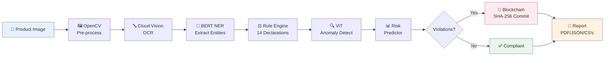
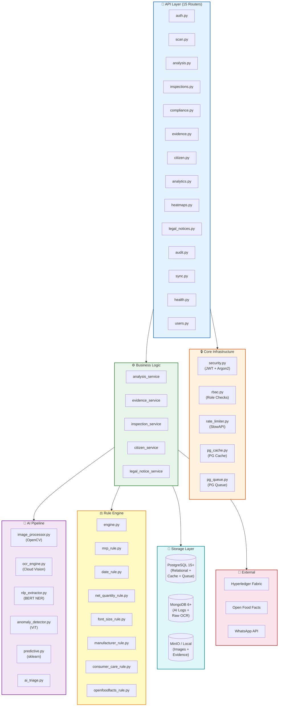
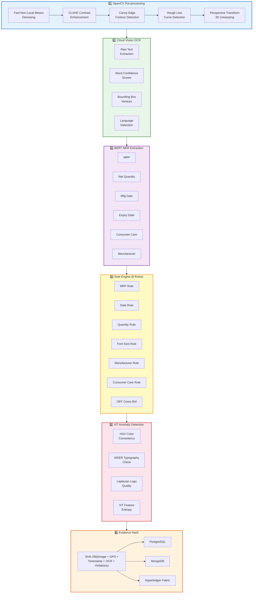
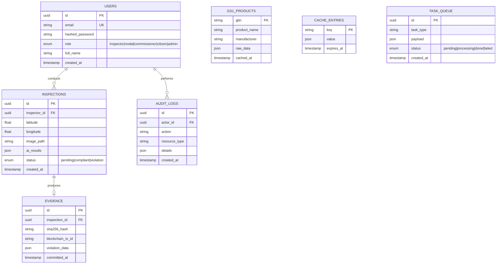

<


<br>

[🚀 Quick Start](#-getting-started) · [🧠 AI Pipeline](#-ai-pipeline) · [🔌 API Reference](#-api-reference) · [🗄️ Database](#-database-schema) · [🧪 Tests](#-test-coverage) · [🚢 Deployment](#-deployment)

</div>

---

## 📋 Overview

The PARAKH backend is a high-performance **Python FastAPI** application that orchestrates:



- **15 REST API routers** with versioned endpoints
- **6-stage AI/CV pipeline** for label compliance verification
- **Blockchain evidence chain** for tamper-proof legal admissibility
- **Multi-database architecture** — PostgreSQL + MongoDB + MinIO
- **Zero-Redis architecture** — PostgreSQL-native cache & task queue

---

## 🏗️ Architecture



<details>
<summary><b>📂 Full Directory Structure</b></summary>

```
backend/
├── app/
│   ├── main.py                         # 🚀 FastAPI application entry point
│   ├── config.py                       # ⚙️ Pydantic BaseSettings configuration
│   │
│   ├── ai/                             # 🧠 AI / Computer Vision Pipeline
│   │   ├── image_processor.py          #   OpenCV: CLAHE, 3D unwarping, contours, rotation
│   │   ├── ocr_engine.py              #   Google Cloud Vision OCR + confidence scores
│   │   ├── nlp_extractor.py           #   BERT NER: manufacturer, MRP, dates, quantity
│   │   ├── anomaly_detector.py        #   ViT: tampered labels, overprinted MRPs
│   │   ├── predictive.py              #   GradientBoosting: non-compliance risk scoring
│   │   └── ai_triage.py              #   Complaint triage & inspection prioritization
│   │
│   ├── api/
│   │   ├── deps.py                    #   Dependency injection (auth, DB sessions, RBAC)
│   │   └── v1/                        #   Versioned API routers
│   │       ├── router.py             #     Master router (mounts all sub-routers)
│   │       ├── auth.py               #     POST /auth/login, /auth/register
│   │       ├── users.py             #     GET /users/me, PUT /users/{id}
│   │       ├── scan.py              #     POST /scan/upload, GET /scan/barcode/{gtin}
│   │       ├── analysis.py          #     POST /analysis/{id}/verify
│   │       ├── inspections.py       #     CRUD + export (PDF/JSON/CSV)
│   │       ├── compliance.py        #     GET /compliance/{id}
│   │       ├── evidence.py          #     POST /evidence/commit, GET /evidence/verify
│   │       ├── citizen.py           #     POST /citizen/report, /citizen/whatsapp
│   │       ├── analytics.py         #     GET /analytics/summary
│   │       ├── heatmaps.py          #     GET /heatmaps
│   │       ├── legal_notices.py     #     POST /legal-notices/generate
│   │       ├── audit.py             #     GET /audit/logs
│   │       ├── sync.py              #     POST /sync/push, GET /sync/pull
│   │       └── health.py            #     GET /health, GET /ready
│   │
│   ├── analytics/                      # 📊 Analytics aggregation logic
│   ├── audit/                          # 📋 Audit trail service
│   │
│   ├── blockchain/                     # 🔗 Hyperledger Fabric Integration
│   │   ├── fabric_client.py           #   gRPC client for NIC MeghRaj Cloud
│   │   ├── evidence_chain.py          #   SHA-256 payload hashing & ledger commit
│   │   └── verifier.py               #   Evidence integrity verification
│   │
│   ├── core/                           # 🔒 Core Infrastructure
│   │   ├── security.py                #   OAuth2 JWT, Argon2/BCrypt password hashing
│   │   ├── rbac.py                    #   Role-Based Access Control enforcement
│   │   ├── rate_limiter.py            #   Per-endpoint SlowAPI rate limiting
│   │   ├── pg_cache.py                #   PostgreSQL-native key-value cache
│   │   ├── pg_queue.py                #   PostgreSQL-native task queue (SKIP LOCKED)
│   │   ├── middleware.py              #   Request logging & error handling
│   │   ├── exceptions.py             #   Custom exception hierarchy
│   │   └── responses.py              #   Standardized API response wrappers
│   │
│   ├── db/                             # 🗄️ Database Connectors
│   │   ├── postgres.py                #   SQLAlchemy async engine & session factory
│   │   └── mongodb.py                 #   Motor async MongoDB client
│   │
│   ├── integrations/                   # 🌐 External API Clients
│   │   ├── openfoodfacts_client.py    #   Open Food Facts barcode lookup
│   │   ├── whatsapp_client.py         #   WhatsApp Business API messaging
│   │   └── gs1_client.py             #   GS1 lookup interface
│   │
│   ├── models/                         # 📝 SQLAlchemy ORM Models
│   │   ├── user.py                    #   User account with role & hashed password
│   │   ├── inspection.py             #   Inspection record with GPS & image path
│   │   ├── evidence.py               #   Blockchain evidence with SHA-256 hash
│   │   ├── gs1_product.py            #   Open Food Facts cached product data
│   │   ├── audit_log.py              #   System audit trail entries
│   │   ├── cache_entry.py            #   PostgreSQL cache table (TTL key-value)
│   │   └── task_queue.py             #   PostgreSQL task queue (job lifecycle)
│   │
│   ├── repositories/                   # 📂 Data Access Layer (Repository Pattern)
│   │   ├── inspection_repo.py
│   │   ├── evidence_repo.py
│   │   ├── gs1_repo.py
│   │   └── user_repo.py
│   │
│   ├── rules/                          # ⚖️ Legal Metrology Compliance Rule Engine
│   │   ├── engine.py                  #   Rule orchestrator (runs all rules)
│   │   ├── base.py                    #   Abstract base rule class
│   │   ├── mrp_rule.py               #   MRP declaration validation
│   │   ├── date_rule.py              #   Manufacturing/Expiry date validation
│   │   ├── net_quantity_rule.py       #   Net quantity declaration validation
│   │   ├── font_size_rule.py         #   Font size & readability analysis
│   │   ├── manufacturer_rule.py      #   Manufacturer details validation
│   │   ├── consumer_care_rule.py     #   Consumer care contact validation
│   │   ├── openfoodfacts_rule.py     #   Cross-reference with OFF registry
│   │   └── legal_metrology_rules.json #  Machine-readable rules database
│   │
│   ├── schemas/                        # 📋 Pydantic Request/Response Schemas
│   ├── security/                       # 🔐 Password hashing, JWT, AES encryption
│   ├── services/                       # ⚙️ Business Logic Layer
│   │   ├── analysis_service.py        #   End-to-end AI pipeline orchestrator
│   │   ├── evidence_service.py        #   Evidence packaging & blockchain commit
│   │   ├── auth_service.py            #   Authentication business logic
│   │   ├── scan_service.py            #   Image upload & processing
│   │   ├── inspection_service.py      #   Inspection lifecycle management
│   │   ├── citizen_service.py         #   Citizen complaint handling
│   │   ├── legal_notice_service.py    #   PDF legal notice generation
│   │   ├── heatmap_service.py         #   Geographic risk zone computation
│   │   ├── analytics_service.py       #   Dashboard metric aggregation
│   │   ├── sync_service.py            #   Offline data sync management
│   │   └── user_service.py            #   User account management
│   │
│   └── storage/                        # 🗂️ Object Storage Abstraction
│       └── __init__.py                #   MinIO (S3) & Local filesystem backends
│
├── tests/                              # 🧪 Test Suite (37 tests)
│   ├── conftest.py                    #   Shared fixtures (async DB, auth headers)
│   ├── test_auth.py                   #   Authentication & JWT (5 tests)
│   ├── test_citizen.py                #   Citizen complaints (2 tests)
│   ├── test_compliance.py             #   Rule engine evaluation (3 tests)
│   ├── test_evidence.py               #   SHA-256 hash & evidence (2 tests)
│   ├── test_gs1.py                    #   Open Food Facts integration (4 tests)
│   ├── test_ocr.py                    #   OCR engine (4 tests)
│   ├── test_pg_cache_queue.py         #   PostgreSQL cache & queue (4 tests)
│   ├── test_rules.py                  #   Legal Metrology rules (10 tests)
│   └── test_security.py              #   File validation & security (3 tests)
│
├── requirements.txt                    # 📦 Python dependencies (93 packages)
└── .env.example                        # ⚙️ Environment variables template
```

</details>

---

## 🚀 Getting Started

### Prerequisites

| Requirement | Version | Required |
|:---:|:---:|:---:|
|  | 3.11+ | ✅ |
|  | 15+ | ✅ |
|  | 6+ | ✅ |
|  | Latest | Optional |
| Google Cloud Vision API Key | — | Optional (for live OCR) |

### Installation

```bash
# 1. Navigate to backend directory
cd backend

# 2. Create and activate virtual environment
python -m venv venv
source venv/bin/activate          # Linux/macOS
# venv\Scripts\activate           # Windows

# 3. Install dependencies
pip install -r requirements.txt

# 4. Configure environment
cp .env.example .env
# ⚠️ Edit .env with your database credentials, API keys, etc.
```

### Database Setup

```bash
# Create PostgreSQL database
psql -U postgres -c "CREATE USER parakh_user WITH PASSWORD 'your_password';"
psql -U postgres -c "CREATE DATABASE parakh_db OWNER parakh_user;"

# Run Alembic migrations
alembic upgrade head
```

### Run Development Server

```bash
uvicorn app.main:app --host 0.0.0.0 --port 8000 --reload
```

> 📖 **API available at:**
> - **Swagger UI:** http://localhost:8000/docs
> - **ReDoc:** http://localhost:8000/redoc
> - **Health Check:** http://localhost:8000/api/v1/health
> - **Readiness Probe:** http://localhost:8000/api/v1/ready

### Run Tests

```bash
# Run all 37 tests
python -m pytest

# Verbose output
python -m pytest -v

# With coverage report
python -m pytest --cov=app --cov-report=term-missing
```

---

## 🧠 AI Pipeline

The compliance verification pipeline runs through **6 stages**:



<details>
<summary><b>📋 AI Module Details</b></summary>

| Module | File | Technology | Input | Output |
|---|---|---|---|---|
| **Image Processor** | `ai/image_processor.py` | OpenCV 4.x | Raw image | Enhanced, unwarped image |
| **OCR Engine** | `ai/ocr_engine.py` | Google Cloud Vision | Enhanced image | Text + bounding boxes + confidence |
| **NLP Extractor** | `ai/nlp_extractor.py` | `dslim/bert-base-NER` | OCR text | Named entities (MRP, dates, etc.) |
| **Anomaly Detector** | `ai/anomaly_detector.py` | `google/vit-base-patch16-224` | Original image | Anomaly flags + confidence scores |
| **Risk Predictor** | `ai/predictive.py` | `GradientBoostingClassifier` | Feature vector | Risk score (0.0–1.0) |
| **AI Triage** | `ai/ai_triage.py` | Custom | Complaint text | Priority classification |

</details>

<details>
<summary><b>⚖️ Rule Engine Details (8 Rules)</b></summary>

| Rule | File | Validates |
|---|---|---|
| **MRP Rule** | `rules/mrp_rule.py` | Maximum Retail Price declared, format correct, includes taxes |
| **Date Rule** | `rules/date_rule.py` | Manufacturing & Expiry/Best-Before dates present and valid |
| **Net Quantity Rule** | `rules/net_quantity_rule.py` | Net quantity declared in standard units (g, ml, m, etc.) |
| **Font Size Rule** | `rules/font_size_rule.py` | Declarations meet minimum font size requirements per package area |
| **Manufacturer Rule** | `rules/manufacturer_rule.py` | Manufacturer name, address, and FSSAI license present |
| **Consumer Care Rule** | `rules/consumer_care_rule.py` | Consumer care contact (phone/email/address) present |
| **OFF Cross-Ref** | `rules/openfoodfacts_rule.py` | Product barcode matches registered manufacturer in OFF registry |
| **Base Rule** | `rules/base.py` | Abstract base class for all rules |

</details>

---

## ⚙️ Environment Variables

> Full template: [`.env.example`](.env.example) — **50+ configurable variables**

<details>
<summary><b>🔧 Core Application</b></summary>

| Variable | Default | Description |
|---|---|---|
| `APP_ENV` | `development` | `development` / `staging` / `production` |
| `DEBUG` | `true` | Enable debug mode |
| `HOST` | `0.0.0.0` | Server bind address |
| `PORT` | `8000` | Server port |
| `WORKERS` | `4` | Uvicorn worker count |

</details>

<details>
<summary><b>🗄️ Databases</b></summary>

| Variable | Default | Description |
|---|---|---|
| `DATABASE_URL` | `postgresql+asyncpg://...` | PostgreSQL async connection |
| `DATABASE_URL_SYNC` | `postgresql://...` | PostgreSQL sync (Alembic) |
| `DB_POOL_SIZE` | `20` | Connection pool size |
| `DB_MAX_OVERFLOW` | `10` | Max overflow connections |
| `MONGODB_URL` | `mongodb://localhost:27017` | MongoDB connection |
| `MONGODB_DATABASE` | `parakh_db` | MongoDB database name |
| `USE_POSTGRES_CACHE` | `true` | Enable PG-native caching |
| `USE_POSTGRES_QUEUE` | `true` | Enable PG-native task queue |

</details>

<details>
<summary><b>🔒 Authentication & Security</b></summary>

| Variable | Default | Description |
|---|---|---|
| `JWT_SECRET_KEY` | — | ⚠️ **MUST CHANGE** — JWT signing secret |
| `JWT_ALGORITHM` | `HS256` | JWT algorithm |
| `JWT_ACCESS_TOKEN_EXPIRE_MINUTES` | `30` | Access token TTL |
| `JWT_REFRESH_TOKEN_EXPIRE_DAYS` | `7` | Refresh token TTL |
| `ENCRYPTION_KEY` | — | ⚠️ **MUST CHANGE** — AES-256 key |
| `API_KEY` | — | API key for service-to-service auth |

</details>

<details>
<summary><b>🧠 AI / ML Models</b></summary>

| Variable | Default | Description |
|---|---|---|
| `GOOGLE_CLOUD_VISION_KEY` | — | Google Cloud Vision API key |
| `GOOGLE_APPLICATION_CREDENTIALS` | — | Service account JSON path |
| `NER_MODEL_NAME` | `dslim/bert-base-NER` | HuggingFace NER model |
| `VIT_MODEL_NAME` | `google/vit-base-patch16-224` | ViT anomaly model |
| `NER_CONFIDENCE_THRESHOLD` | `0.5` | Minimum NER confidence |
| `ANOMALY_DETECTION_ENABLED` | `true` | Enable ViT detection |

</details>

<details>
<summary><b>🌐 External Integrations</b></summary>

| Variable | Default | Description |
|---|---|---|
| `OPENFOODFACTS_API_URL` | `https://world.openfoodfacts.org/api/v2` | Product registry |
| `WHATSAPP_ENABLED` | `false` | Enable WhatsApp Business |
| `WHATSAPP_API_URL` | `https://graph.facebook.com/v18.0` | WhatsApp Graph API |
| `BLOCKCHAIN_ENABLED` | `false` | Enable Hyperledger Fabric |
| `BLOCKCHAIN_ENDPOINT` | `grpc://localhost:7051` | Fabric peer endpoint |

</details>

<details>
<summary><b>⚡ Rate Limiting & File Upload</b></summary>

| Variable | Default | Description |
|---|---|---|
| `RATE_LIMIT_LOGIN` | `5/minute` | Login throttle |
| `RATE_LIMIT_UPLOAD` | `20/minute` | Upload throttle |
| `RATE_LIMIT_ANALYSIS` | `10/minute` | AI analysis throttle |
| `RATE_LIMIT_DEFAULT` | `60/minute` | Default throttle |
| `MAX_UPLOAD_SIZE_MB` | `25` | Maximum file size |
| `ALLOWED_IMAGE_TYPES` | `image/jpeg,image/png,image/webp` | Accepted MIME types |
| `MIN_IMAGE_RESOLUTION` | `640` | Minimum image resolution |

</details>

---

## 🔌 API Reference

> 📖 **Interactive docs:** `http://localhost:8000/docs` (Swagger UI)

All endpoints prefixed with `/api/v1`:

<details>
<summary><b>🏥 Health & System</b></summary>

| Method | Endpoint | Auth | Description |
|:---:|---|:---:|---|
| `GET` | `/health` | — | Liveness probe |
| `GET` | `/ready` | — | Readiness probe (DB connectivity) |

</details>

<details>
<summary><b>🔑 Authentication</b></summary>

| Method | Endpoint | Auth | Description |
|:---:|---|:---:|---|
| `POST` | `/auth/login` | — | JWT login (returns access + refresh tokens) |
| `POST` | `/auth/register` | — | User registration |

```bash
# Register a new user
curl -X POST http://localhost:8000/api/v1/auth/register \
  -H "Content-Type: application/json" \
  -d '{"email": "inspector@parakh.gov.in", "password": "SecurePass123!", "role": "inspector"}'

# Login and get JWT token
curl -X POST http://localhost:8000/api/v1/auth/login \
  -H "Content-Type: application/json" \
  -d '{"email": "inspector@parakh.gov.in", "password": "SecurePass123!"}'
```

</details>

<details>
<summary><b>📸 Scanning & Processing</b></summary>

| Method | Endpoint | Auth | Description |
|:---:|---|:---:|---|
| `POST` | `/scan/upload` | JWT | Upload product image for processing |
| `POST` | `/scan/process` | JWT | Trigger AI pipeline on uploaded image |
| `GET` | `/scan/barcode/{gtin}` | — | Public barcode lookup (rate-limited) |

```bash
# Upload product image
curl -X POST http://localhost:8000/api/v1/scan/upload \
  -H "Authorization: Bearer <token>" \
  -F "file=@product_label.jpg" \
  -F "latitude=28.6139" \
  -F "longitude=77.2090"
```

</details>

<details>
<summary><b>🤖 Analysis & Compliance</b></summary>

| Method | Endpoint | Auth | Description |
|:---:|---|:---:|---|
| `POST` | `/analysis/{id}/verify` | JWT | Run full AI compliance pipeline |
| `GET` | `/compliance/{id}` | JWT | Get rule engine results |

```bash
# Run full AI compliance check
curl -X POST http://localhost:8000/api/v1/analysis/<inspection_id>/verify \
  -H "Authorization: Bearer <token>" \
  -d '{"product_barcode": "8901234567890"}'
```

</details>

<details>
<summary><b>📋 Inspections</b></summary>

| Method | Endpoint | Auth | Description |
|:---:|---|:---:|---|
| `GET` | `/inspections` | JWT | List inspections (paginated, filterable) |
| `POST` | `/inspections` | JWT | Create new inspection record |
| `GET` | `/inspections/{id}/export/pdf` | JWT | Export as PDF report |
| `GET` | `/inspections/{id}/export/json` | JWT | Export as JSON |
| `GET` | `/inspections/{id}/export/csv` | JWT | Export as CSV |

</details>

<details>
<summary><b>🔗 Evidence & Blockchain</b></summary>

| Method | Endpoint | Auth | Description |
|:---:|---|:---:|---|
| `POST` | `/evidence/commit` | JWT | Commit evidence hash to blockchain |
| `GET` | `/evidence/verify` | JWT | Verify evidence integrity |

```bash
# Commit evidence to blockchain
curl -X POST http://localhost:8000/api/v1/evidence/commit \
  -H "Authorization: Bearer <token>" \
  -d '{"inspection_id": "<uuid>", "ocr_text_snapshot": "...", "violation_data": {...}}'

# Verify evidence integrity
curl -X GET http://localhost:8000/api/v1/evidence/<evidence_id>/verify \
  -H "Authorization: Bearer <token>"
```

</details>

<details>
<summary><b>👤 Citizen Portal</b></summary>

| Method | Endpoint | Auth | Description |
|:---:|---|:---:|---|
| `POST` | `/citizen/report` | JWT | Submit citizen complaint |
| `POST` | `/citizen/whatsapp` | — | WhatsApp webhook (inbound messages) |

</details>

<details>
<summary><b>📊 Analytics & Reporting</b></summary>

| Method | Endpoint | Auth | Description |
|:---:|---|:---:|---|
| `GET` | `/analytics/summary` | JWT | Dashboard analytics (role-filtered) |
| `GET` | `/heatmaps` | JWT | Geographic violation clusters |
| `POST` | `/legal-notices/generate` | JWT | Generate PDF legal notice |
| `GET` | `/audit/logs` | JWT (Admin) | System audit trail |
| `POST` | `/sync/push` | JWT | Push offline records |
| `GET` | `/sync/pull` | JWT | Pull latest records |

</details>

---

## 🗄️ Database Schema



<details>
<summary><b>📝 MongoDB Collections</b></summary>

| Collection | Purpose | Schema |
|---|---|---|
| `ai_extraction_logs` | Raw OCR dumps, NLP entities, bounding boxes, ViT findings | Flexible JSON |

</details>

---

## 🧪 Test Coverage

```bash
# Run all tests
python -m pytest -v
```

| Test File | Tests | Coverage Area |
|---|:---:|---|
| `test_auth.py` | 5 | 🔑 JWT login, registration, token refresh, password hashing |
| `test_rules.py` | 10 | ⚖️ Individual rule validations (MRP, dates, quantity, etc.) |
| `test_compliance.py` | 3 | ✅ Rule engine overall status evaluation |
| `test_ocr.py` | 4 | 🔤 OCR engine initialization and text extraction |
| `test_gs1.py` | 4 | 🔍 Open Food Facts barcode lookup & caching |
| `test_pg_cache_queue.py` | 4 | 🗄️ PostgreSQL cache CRUD/expiration & task queue lifecycle |
| `test_security.py` | 3 | 🔒 File validation, MIME checking, embedded script rejection |
| `test_evidence.py` | 2 | 🔗 SHA-256 hash computation & evidence packaging |
| `test_citizen.py` | 2 | 👤 Citizen complaint submission & WhatsApp webhook |
| **Total** | **37** | **All passing ✅** |

---

## 📦 Dependencies

<details>
<summary><b>🔧 Production Dependencies (by category)</b></summary>

| Category | Packages |
|---|---|
| **Core Framework** | `fastapi`, `uvicorn`, `pydantic`, `pydantic-settings`, `python-multipart` |
| **Auth & Security** | `python-jose`, `passlib`, `bcrypt`, `cryptography` |
| **PostgreSQL** | `sqlalchemy`, `asyncpg`, `alembic`, `psycopg2-binary`, `aiosqlite` |
| **MongoDB** | `motor`, `pymongo` |
| **AI / Vision** | `opencv-python-headless`, `numpy`, `Pillow` |
| **OCR** | `google-cloud-vision` |
| **NLP** | `transformers`, `torch`, `tokenizers` |
| **Anomaly Detection** | `timm` |
| **Predictive** | `scikit-learn`, `pandas`, `joblib` |
| **Object Storage** | `boto3`, `aiofiles` |
| **PDF Generation** | `reportlab`, `PyPDF2` |
| **HTTP Client** | `httpx`, `aiohttp` |
| **Rate Limiting** | `limits`, `slowapi` |
| **Logging** | `structlog`, `python-json-logger` |
| **File Validation** | `python-magic`, `filetype` |

</details>

<details>
<summary><b>🧪 Development Dependencies</b></summary>

| Package | Purpose |
|---|---|
| `pytest` + `pytest-asyncio` + `pytest-cov` | Testing framework |
| `factory-boy` + `faker` | Test data generation |
| `black` | Code formatting |
| `ruff` | Fast linting |
| `mypy` | Type checking |
| `pre-commit` | Git hooks |

</details>

---

## 🚢 Deployment

<details>
<summary><b>🖥️ Development</b></summary>

```bash
uvicorn app.main:app --host 0.0.0.0 --port 8000 --reload
```

</details>

<details>
<summary><b>🐳 Docker</b></summary>

```dockerfile
FROM python:3.11-slim
WORKDIR /app
COPY requirements.txt .
RUN pip install --no-cache-dir -r requirements.txt
COPY . .
CMD ["uvicorn", "app.main:app", "--host", "0.0.0.0", "--port", "8000"]
```

```bash
docker build -t parakh-backend .
docker run -d --name parakh-api -p 8000:8000 --env-file .env parakh-backend
```

</details>

<details>
<summary><b>☁️ Production (PaaS)</b></summary>

```bash
# Procfile
web: uvicorn app.main:app --host 0.0.0.0 --port $PORT --workers 4
```

</details>

<details>
<summary><b>✅ Production Checklist</b></summary>

- [ ] Set `APP_ENV=production` and `DEBUG=false`
- [ ] Generate strong `JWT_SECRET_KEY`: `python -c "import secrets; print(secrets.token_urlsafe(64))"`
- [ ] Generate strong `ENCRYPTION_KEY`
- [ ] Configure PostgreSQL with SSL
- [ ] Set up PgBouncer for connection pooling
- [ ] Enable `BLOCKCHAIN_ENABLED=true` with NIC credentials
- [ ] Configure HTTPS reverse proxy (Nginx/Traefik)
- [ ] Disable Swagger UI (`/docs`) in production
- [ ] Enable `AUDIT_LOG_ENABLED=true`

</details>

---

## 🛠️ Development

```bash
# Code formatting
black app/ tests/

# Linting
ruff check app/ tests/

# Type checking
mypy app/

# Database migration
alembic revision --autogenerate -m "description"
alembic upgrade head
```

---

<div align="center">

**🖥️ PARAKH Backend** — *AI-powered compliance at scale*

Part of [Project PARAKH](../README.md) — Government of India

</div>
]]>
