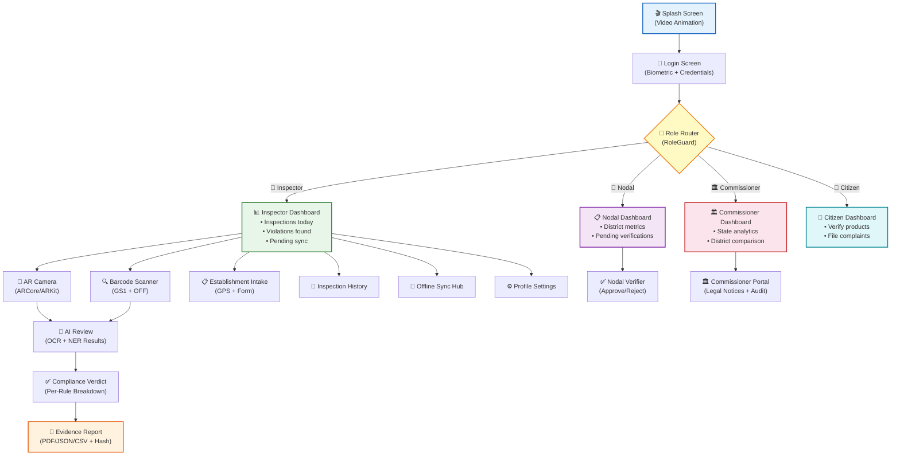
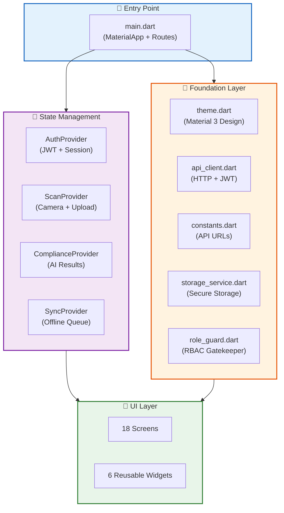
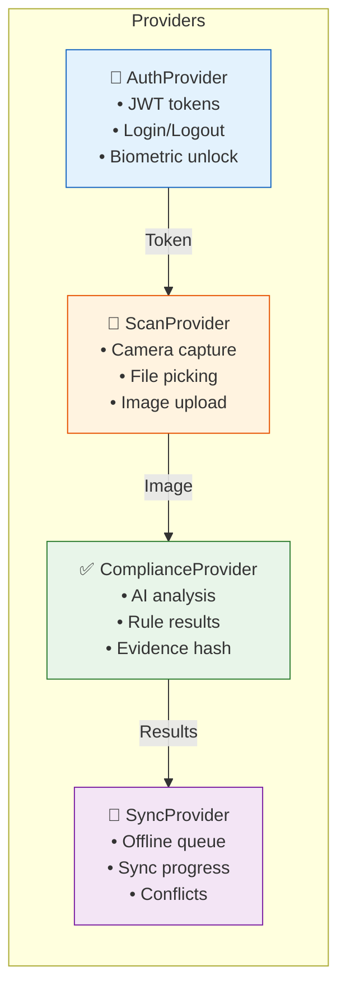
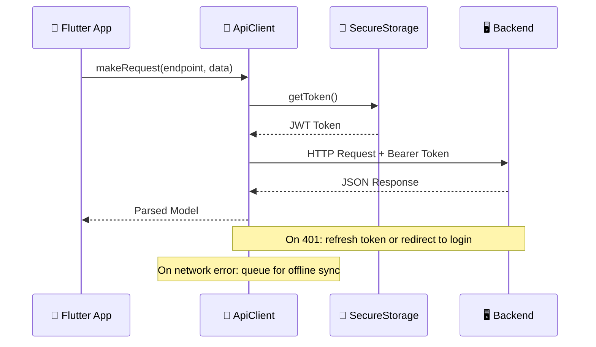

<


<br>

[📱 Screens](#-screens--navigation) · [🚀 Quick Start](#-getting-started) · [🎨 Design System](#-design-system) · [🔌 Dependencies](#-dependencies) · [🏗️ Architecture](#-architecture)

</div>

---

## 📋 Overview

The PARAKH mobile app is a **Flutter 3.x** application designed for field enforcement officers under the Legal Metrology Act, 2009. It provides:

- 📸 **AR-powered real-time product scanning** with guided overlay boxes
- 🔍 **GS1 barcode verification** with live Open Food Facts registry lookup
- 🤖 **One-tap AI compliance checks** — OCR → NER → Rule Engine → Anomaly Detection
- 📶 **Offline-first architecture** — full functionality without connectivity
- 🔐 **Biometric authentication** — fingerprint/Face ID secure login
- 📄 **Multi-format reports** — PDF, JSON, CSV with blockchain verification
- 👥 **4 role-isolated dashboards** — Inspector, Nodal, Commissioner, Citizen

---

## 📱 Screens & Navigation

The app contains **18 fully implemented screens** with role-based routing:



<details>
<summary><b>📋 Complete Screen Reference</b></summary>

<br>

#### 🔐 Common Screens
| # | Screen | File | Description |
|:---:|--------|------|-------------|
| 1 | 🎬 **Splash** | `splash_screen.dart` | Animated logo + video splash with auto-navigation to login/dashboard |
| 2 | 🔑 **Login** | `login_screen.dart` | JWT authentication with biometric unlock and role selection modal |
| 3 | ⚙️ **Profile** | `profile_settings_screen.dart` | Officer profile, notification preferences, biometric toggle, logout |

#### 👮 Inspector Screens
| # | Screen | File | Description |
|:---:|--------|------|-------------|
| 4 | 📊 **Inspector Dashboard** | `inspector_dashboard_screen.dart` | Metric cards (inspections, violations, sync), quick-action tiles |
| 5 | 📸 **AR Camera** | `ar_camera_screen.dart` | ARCore/ARKit guided capture with real-time bounding box overlays |
| 6 | 🔍 **Barcode Scanner** | `barcode_scanner_screen.dart` | GS1 Modulo-10 validation + Open Food Facts lookup + manual GTIN |
| 7 | 🤖 **AI Review** | `ai_review_screen.dart` | Side-by-side: original image ↔ AI extracted fields with confidence |
| 8 | ✅ **Compliance Verdict** | `compliance_verdict_screen.dart` | Pass/Fail verdict with per-declaration breakdown and evidence hash |
| 9 | 📄 **Evidence Report** | `evidence_report_screen.dart` | Multi-format export (PDF/JSON/CSV) with blockchain hash & photos |
| 10 | 📋 **Establishment Intake** | `establishment_intake_screen.dart` | Structured establishment form with GPS auto-fill and photo capture |
| 11 | 📜 **Inspection History** | `inspection_history_screen.dart` | Searchable, filterable list of all past inspections |
| 12 | 📶 **Offline Sync Hub** | `offline_sync_hub_screen.dart` | Pending uploads queue, manual sync trigger, conflict resolution |

#### 🏢 Nodal Officer Screens
| # | Screen | File | Description |
|:---:|--------|------|-------------|
| 13 | 📋 **Nodal Dashboard** | `nodal_dashboard_screen.dart` | District-level metrics, pending verifications, compliance trends |
| 14 | ✅ **Nodal Verifier** | `nodal_verifier_screen.dart` | Review inspector evidence, approve/reject/return with comments |

#### 🏛️ Commissioner Screens
| # | Screen | File | Description |
|:---:|--------|------|-------------|
| 15 | 🏛️ **Commissioner Dashboard** | `commissioner_dashboard_screen.dart` | State-wide analytics, district comparison, violation heatmap |
| 16 | 🏛️ **Commissioner Portal** | `commissioner_portal_screen.dart` | Legal notice generation, audit trail, policy management |

#### 👤 Citizen Screens
| # | Screen | File | Description |
|:---:|--------|------|-------------|
| 17 | 👤 **Citizen Dashboard** | `citizen_dashboard_screen.dart` | Barcode verification, file complaints, track complaint status |

#### 🔀 Routing
| # | Screen | File | Description |
|:---:|--------|------|-------------|
| 18 | 🔀 **Dashboard Router** | `dashboard_screen.dart` | Routes to role-specific dashboard based on `RoleGuard` |

</details>

---

## 🏗️ Architecture



<details>
<summary><b>📂 Full Directory Structure</b></summary>

```
frontend/
├── lib/
│   ├── main.dart                        # 🚀 App entry point, MaterialApp, route definitions
│   │
│   ├── core/                            # 🎨 Foundation Layer
│   │   ├── theme.dart                   #   Material 3 design system (colors, typography, radii)
│   │   ├── api_client.dart              #   HTTP client with JWT token management
│   │   ├── constants.dart               #   API base URLs, endpoints, app constants
│   │   ├── role_guard.dart              #   RBAC UI gatekeeper (role-based route protection)
│   │   └── storage_service.dart         #   Secure local storage (SharedPreferences + encrypted)
│   │
│   ├── models/                          # 📋 Data Models
│   │   └── models.dart                  #   All Dart models (User, Inspection, Evidence, Product, etc.)
│   │
│   ├── providers/                       # 🔄 State Management (Provider Pattern)
│   │   ├── auth_provider.dart           #   Authentication state, JWT, login/logout, biometric
│   │   ├── scan_provider.dart           #   Camera capture, file picking, image upload, AR data
│   │   ├── compliance_provider.dart     #   AI analysis, rule results, evidence hash, verdict
│   │   └── sync_provider.dart           #   Offline queue, sync progress, conflict resolution
│   │
│   ├── screens/                         # 📱 18 Application Screens (see table above)
│   │
│   └── widgets/                         # 🧩 6 Reusable UI Components
│       ├── parakh_logo.dart             #   Animated PARAKH brand logo (SVG)
│       ├── ar_overlay_box.dart          #   AR bounding box overlay with compliance color coding
│       ├── action_tile.dart             #   Dashboard quick-action tiles (icon + label + tap)
│       ├── metric_card.dart             #   Dashboard metric display cards (value + label)
│       ├── status_pill.dart             #   Status badge (Compliant/Violation/Pending)
│       └── custom_button.dart           #   Themed action button component
│
├── assets/                              # 🎨 Static Assets
│   ├── logo.svg                         #   PARAKH vector logo
│   ├── logo.png                         #   PARAKH raster logo
│   └── splash_video.mp4                 #   Splash screen animation
│
├── android/                             # 🤖 Android Platform Configuration
├── ios/                                 # 🍎 iOS Platform Configuration
└── pubspec.yaml                         # 📦 Flutter Dependencies
```

</details>

---

## 🚀 Getting Started

### Prerequisites

| Requirement | Version | Notes |
|:---:|:---:|---|
|  | 3.0+ | `flutter doctor` should report no issues |
|  | 3.0+ | Bundled with Flutter SDK |
|  | API 21+ | Android Studio + SDK installed |
|  | 14+ | macOS only — for iOS builds |
| 📱 Physical Device | — | **Recommended** for camera and GPS testing |

### Installation

```bash
# 1. Navigate to frontend directory
cd frontend

# 2. Install Flutter dependencies
flutter pub get

# 3. Run on connected device or emulator
flutter run

# 4. Build release APK (production)
flutter build apk --release
```

### Backend Connection

Update `lib/core/constants.dart` with your backend IP:

```dart
static const String baseUrl = 'http://YOUR_BACKEND_IP:8000/api/v1';
// ⚡ Android emulator: use http://10.0.2.2:8000/api/v1
// 📱 Physical device: use your machine's LAN IP
```

> 📖 **Device connectivity troubleshooting** → [`../tools/DEVICE_CONNECTIVITY_GUIDE.md`](../tools/DEVICE_CONNECTIVITY_GUIDE.md)

---

## 📦 Dependencies

<details>
<summary><b>🔧 Production Dependencies</b></summary>

| Package | Version | Purpose |
|---|:---:|---|
| `flutter_svg` | ^2.0.10+1 | 🎨 SVG logo rendering |
| `google_fonts` | ^6.2.1 | 🔤 Inter typography (Google Fonts) |
| `provider` | ^6.1.2 | 🔄 State management |
| `http` | ^1.2.1 | 🌐 REST API communication |
| `intl` | ^0.19.0 | 🌍 Date/number formatting & i18n |
| `shared_preferences` | ^2.2.3 | 💾 Local key-value storage |
| `crypto` | ^3.0.3 | #️⃣ SHA-256 client-side hashing |
| `uuid` | ^4.4.0 | 🆔 Unique ID generation |
| `path_provider` | ^2.1.3 | 📂 App directory paths |
| `file_picker` | ^8.0.3 | 📁 Image file selection from gallery |
| `camera` | ^0.12.0+2 | 📸 Live camera access for AR scanning |
| `geolocator` | ^13.0.1 | 📍 GPS location for evidence tagging |
| `local_auth` | ^2.3.0 | 🔐 Biometric (fingerprint/face) authentication |
| `video_player` | ^2.9.2 | 🎬 Video splash screen playback |

</details>

<details>
<summary><b>🧪 Development Dependencies</b></summary>

| Package | Version | Purpose |
|---|:---:|---|
| `flutter_test` | SDK | Widget testing framework |
| `flutter_lints` | ^3.0.2 | Dart lint rules |
| `flutter_launcher_icons` | ^0.13.1 | App icon generation |

</details>

---

## 🎨 Design System

The app uses a custom **Material 3-inspired** design system defined in `lib/core/theme.dart`:

<details>
<summary><b>🎨 Color Palette</b></summary>

| Token | Hex | Preview | Usage |
|---|---|:---:|---|
| `primary` | `#1565C0` | 🔵 | Buttons, links, active elements |
| `primaryContainer` | `#BBDEFB` | 🔹 | Selected states, chips |
| `surface` | `#FAFAFA` | ⬜ | Screen backgrounds |
| `surfaceContainerLow` | `#F5F5F5` | 🔲 | Cards, tiles |
| `error` | `#D32F2F` | 🔴 | Violation indicators |
| `onSurface` | `#212121` | ⬛ | Primary text |
| `textMuted` | `#757575` | 🔘 | Secondary/caption text |

</details>

<details>
<summary><b>🔤 Typography</b></summary>

| Style | Font | Weight | Size |
|---|---|---|:---:|
| **Headline** | Inter (Google Fonts) | Bold (700) | 24sp |
| **Title** | Inter (Google Fonts) | SemiBold (600) | 18sp |
| **Body** | Inter (Google Fonts) | Regular (400) | 14sp |
| **Caption** | Inter (Google Fonts) | Medium (500) | 12sp |

</details>

<details>
<summary><b>📐 Border Radius Tokens</b></summary>

| Token | Value | Usage |
|---|:---:|---|
| `radiusSmall` | 8px | Input fields |
| `radiusMedium` | 12px | Cards |
| `radiusLarge` | 16px | Bottom sheets |
| `radiusPill` | 24px | Badges, pills |

</details>

---

## 🔄 State Management

The app uses the **Provider** pattern with 4 dedicated state providers:



| Provider | File | Responsibilities |
|---|---|---|
| `AuthProvider` | `auth_provider.dart` | JWT token management, login/logout, biometric unlock, session persistence |
| `ScanProvider` | `scan_provider.dart` | Camera image capture, file picking, image-to-backend upload, AR overlay data |
| `ComplianceProvider` | `compliance_provider.dart` | AI analysis trigger, rule results, evidence hash display, verdict tracking |
| `SyncProvider` | `sync_provider.dart` | Offline inspection queue, sync progress, conflict resolution |

---

## 🔑 Permissions

<details>
<summary><b>🤖 Android Permissions</b></summary>

Located in `android/app/src/main/AndroidManifest.xml`:

```xml
<uses-permission android:name="android.permission.CAMERA" />
<uses-permission android:name="android.permission.ACCESS_FINE_LOCATION" />
<uses-permission android:name="android.permission.ACCESS_COARSE_LOCATION" />
<uses-permission android:name="android.permission.USE_BIOMETRIC" />
<uses-permission android:name="android.permission.USE_FINGERPRINT" />
```

| Permission | Purpose | When Requested |
|---|---|---|
| 📸 `CAMERA` | AR product scanning, image capture | On first scan launch |
| 📍 `ACCESS_FINE_LOCATION` | GPS coordinates for evidence tagging | On first scan launch |
| 📍 `ACCESS_COARSE_LOCATION` | Fallback GPS | On first scan launch |
| 🔐 `USE_BIOMETRIC` | Fingerprint/Face ID unlock | On login if enabled |
| 🌐 `INTERNET` | Backend API communication | Automatic (manifest) |

</details>

<details>
<summary><b>🍎 iOS Permissions</b></summary>

Located in `ios/Runner/Info.plist`:

```xml
<key>NSCameraUsageDescription</key>
<string>PARAKH needs camera access to scan product labels.</string>
<key>NSLocationWhenInUseUsageDescription</key>
<string>PARAKH needs location to tag inspection evidence with GPS coordinates.</string>
<key>NSFaceIDUsageDescription</key>
<string>PARAKH uses Face ID for secure biometric login.</string>
```

</details>

---

## 🔌 API Client

The `ApiClient` (`lib/core/api_client.dart`) handles all backend communication:



| Feature | Description |
|---|---|
| **Base URL** | Configurable via `Constants.baseUrl` |
| **Authentication** | Automatic `Authorization: Bearer <token>` header injection |
| **Error Handling** | Standardized error parsing and user-facing error messages |
| **Offline Support** | Queues failed requests for retry when connectivity is restored |

---

## 🔒 Security Features

| Feature | Implementation |
|---|---|
| 🔐 **Biometric Lock** | Fingerprint/Face ID via `local_auth` |
| 🔑 **Secure Token Storage** | JWT stored in encrypted `SharedPreferences` |
| 📍 **GPS Evidence** | All scans tagged with precise GPS coordinates |
| #️⃣ **Client-Side Hashing** | SHA-256 pre-computation via `crypto` package |
| 🔒 **Certificate Pinning** | Ready for production TLS certificate pinning |
| 🛡️ **RBAC Guard** | `RoleGuard` prevents unauthorized screen access |

---

## 🏗️ Build & Release

<details>
<summary><b>🤖 Android APK</b></summary>

```bash
flutter build apk --release
# Output: build/app/outputs/flutter-apk/app-release.apk
```

</details>

<details>
<summary><b>📦 Android App Bundle (Play Store)</b></summary>

```bash
flutter build appbundle --release
# Output: build/app/outputs/bundle/release/app-release.aab
```

</details>

<details>
<summary><b>🍎 iOS (macOS only)</b></summary>

```bash
flutter build ios --release
# Then archive via Xcode
```

</details>

<details>
<summary><b>🎨 App Icon Generation</b></summary>

```bash
flutter pub run flutter_launcher_icons
```

Configuration in `pubspec.yaml`:
```yaml
flutter_launcher_icons:
  android: true
  ios: false
  image_path: "assets/logo.png"
  min_sdk_android: 21
```

</details>

---

## 🧪 Testing

```bash
# Run widget tests
flutter test

# Run with coverage
flutter test --coverage
```

---

<div align="center">

**📱 PARAKH Mobile** — *Field enforcement at your fingertips*

Part of [Project PARAKH](../README.md) — Government of India

</div>
]]>
