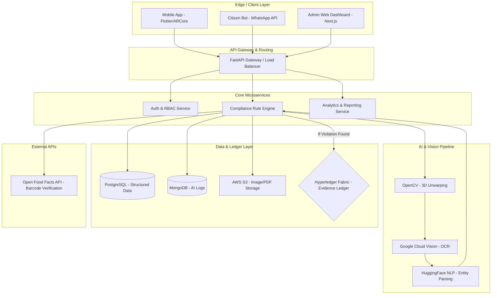

# **System Architecture Document**
**Project PARAKH: Advanced Legal Metrology Compliance System**

**Problem Statement ID:** 26034
**Organization:** Ministry of Consumer Affairs, Food & Public Distribution (DoCA)
**Project Team:** Nikhil Pandey, Tanushree, Sudha, Akshay Paswan, Jitendra Choudhary, Aaryan Kasaudhan

---

## **1. Architectural Overview**
Project PARAKH employs a **microservices-oriented, cloud-native architecture** designed for high scalability, real-time AI processing, and tamper-proof data security. The system bridges edge devices (mobile applications for field officers and citizens) with a centralized cloud processing engine and an immutable blockchain ledger.

---

## **2. High-Level System Diagram**

---

## **3. Component Architecture & Tech Stack**

### **3.1. Edge / Client Layer**
Responsible for data capture, real-time feedback, and user interaction.
*   **Enforcement Mobile App:** Built with **Flutter**. Integrates **ARCore/ARKit** for live bounding box overlays. Includes local SQLite/Hive for offline capabilities.
*   **Web Dashboard:** Built with **Next.js** and **Tailwind CSS**. Serves as the command center for Nodal Officers to view predictive heatmaps and generate PDF legal notices.

### **3.2. Application Logic & API Layer**
Handles routing, business logic, and security.
*   **Framework:** **Python (FastAPI)** is chosen for its native asynchronous support, making it ideal for routing heavy AI/ML workloads.
*   **Endpoints:** RESTful API design (`/api/v1/scan`, `/api/v1/verify`, `/api/v1/evidence`).

### **3.3. AI & Vision Processing Pipeline**
The core intelligence engine responsible for data extraction and validation.
1.  **Computer Vision (OpenCV):** Detects product boundaries and mathematically unwarps curved surfaces (like bottles) to create flat, readable images.
2.  **Optical Character Recognition (Google Cloud Vision API):** Extracts raw text from the flattened image.
3.  **Natural Language Processing (HuggingFace Transformers):** Uses Named Entity Recognition (NER) to classify text into semantic buckets: `MRP`, `Net Weight`, `Mfg Date`, `Customer Care Info`.

### **3.4. Data Storage Strategy (Sovereign Stack)**
*   **PostgreSQL (Relational, Key-Value Cache & Task Queue):** Serves as the primary sovereign database layer managing Users, Roles, Inspection Metadata, Product Registry (`openfoodfacts_products`), Key-Value Cache (`cache_entries`), and Background Task Queue (`task_queue`).
*   **MongoDB (NoSQL):** Stores highly dynamic, unstructured data such as raw OCR text dumps, bounding-box coordinates, and rule-engine execution logs.
*   **Object Storage (MinIO / AWS S3):** Secure storage for high-resolution evidentiary images and generated PDF reports.

### **3.5. Blockchain Evidentiary Ledger**
Ensures the legal admissibility of digital evidence.
*   **Framework:** **Hyperledger Fabric** (managed via AWS Managed Blockchain).
*   **Mechanism:** When a violation is flagged, a SHA-256 hash of the payload (image + timestamp + GPS + extracted text) is written to the blockchain. This cryptographic receipt prevents opposing parties from claiming the digital evidence was doctored.

---

## **4. System Data Flow: Compliance Check Workflow**

1.  **Capture:** Field officer captures product images via the Flutter app. App reads the barcode.
2.  **Ingest:** Image and barcode data are sent securely (TLS) to the FastAPI Gateway. Image is stored in S3; a temporary URL is generated.
3.  **Process:** FastAPI routes the image URL to the AI Pipeline. OpenCV unwarps the image -> OCR extracts text -> NLP parses entities.
4.  **Validate:** The parsed entities (e.g., "MRP ₹ 50") and the Open Food Facts barcode data are fed into the **Compliance Rule Engine**.
5.  **Assess:**
    *   *Scenario A (Compliant):* Engine passes all rules. Status logged to PostgreSQL. Response sent to mobile app (flashes green).
    *   *Scenario B (Violation):* Engine fails a rule (e.g., missing expiry date).
6.  **Secure & Alert (If Violation):** 
    *   Data is hashed and committed to Hyperledger Fabric.
    *   Detailed logs are written to MongoDB.
    *   The Web Dashboard is alerted, updating predictive heatmaps.

---

## **5. Security & Infrastructure**
*   **Authentication:** OAuth2 with JWT (JSON Web Tokens). Role-Based Access Control (RBAC) strictly separates Inspector and Admin privileges.
*   **Encryption:** AES-256 for data at rest (PostgreSQL/S3). TLS 1.3 for all data in transit.
*   **Hosting Deployment:** Containerized using **Docker** and orchestrated via **Kubernetes** to allow horizontal auto-scaling during high-traffic inspection periods (e.g., festival seasons).

