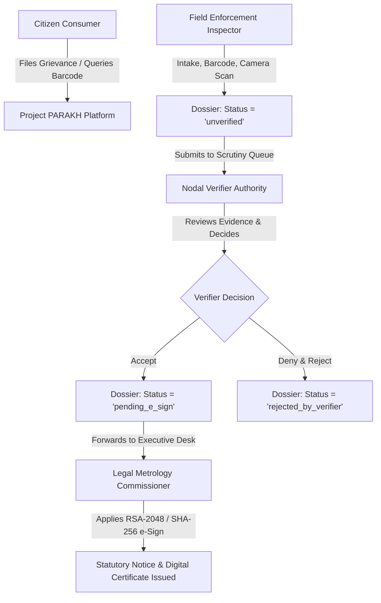

# Project PARAKH — User Types, Roles & RBAC Enforcement Matrix
**Department of Consumer Affairs (DoCA), Ministry of Consumer Affairs, Food & Public Distribution, Government of India**  
**Security Standard**: Strict Role-Based Access Control (RBAC) & Principle of Least Privilege (PoLP)

---

## 1. Executive Summary

To safeguard legal metrology enforcement integrity and prevent conflicts of interest, Project PARAKH strictly segregates duties across four distinct operational roles and one administrative role. Under the statutory mandate:
- **Field Inspectors** gather physical evidence and submit unverified dossiers; they cannot verify or digitally sign notices.
- **Nodal Verifiers** independently audit packaging evidence and decide whether to endorse or reject dossiers; they cannot conduct field scans or issue final notices.
- **Commissioners** hold sole statutory authority under the Legal Metrology Act, 2009 to execute cryptographic digital signatures and issue compounding notices.
- **Citizens** access public consumer protection tools (commodity verification, non-compliance grievance filing) without exposure to internal enforcement queues.

---

## 2. Definitive User Roles Directory



### 2.1 Field Enforcement Inspector (`UserRole.inspector`)
- **Official Designation**: Legal Metrology Inspector (LMI) / Enforcement Officer
- **Primary Function**: Physical inspection of commercial premises, retail outlets, and factory packaging lines.
- **Authorized Capabilities**:
  - Commercial establishment registration (firm name, proprietor, GPS address).
  - GS1 Barcode scanning with live Modulo-10 checksum verification.
  - AR camera capture of packaging surfaces (Principal Display Panel, ingredients, MRP).
  - Review automated OCR extraction and rule engine detections.
  - Offline sync hub for caching and syncing inspections in low-connectivity zones.
  - Inspection ledger history tracking (own submitted inspections).
- **Prohibited Capabilities**:
  - Cannot access Nodal Verifier Scrutiny Desk.
  - Cannot approve or reject submitted dossiers.
  - Cannot execute commissioner digital signatures or issue legal notices.

### 2.2 Nodal Verifier Authority (`UserRole.nodalOfficer`)
- **Official Designation**: Nodal Verification Authority / Zonal Review Officer
- **Primary Function**: Independent second-tier legal scrutiny of evidence submitted by field inspectors.
- **Authorized Capabilities**:
  - Scrutiny queue stream containing pending field dossiers (status `unverified` / `pending_nodal_verification`).
  - Deep-dive inspection of physical packaging photographs, OCR extractions, and Rule 6(1) / Schedule I violations.
  - Mandatory statutory review remarks input.
  - Statutory endorsement actions:
    1. **Accept & Send to Commissioner**: Escalates verified non-compliance dossier to the Commissioner for notice issuance.
    2. **Deny & Reject**: Rejects deficient or non-actionable inspections with audit-logged reasons.
  - Verified dossier audit ledger history.
- **Prohibited Capabilities**:
  - Cannot initiate new field inspections or operate camera intake.
  - Cannot sign or issue statutory legal notices.

### 2.3 Legal Metrology Commissioner (`UserRole.commissioner`)
- **Official Designation**: Controller / Commissioner of Legal Metrology, State / UT
- **Primary Function**: Executive adjudication, statutory notice issuance, and statewide compliance oversight.
- **Authorized Capabilities**:
  - Executive review of dossiers endorsed by Nodal Verifiers.
  - Application of cryptographic **RSA-2048 / SHA-256 digital signatures**.
  - Official Statutory Notice issuance under Sections 36, 39, and 48 of the Legal Metrology Act, 2009.
  - Official Notice Archive with tamper-proof verification QR codes and SHA-256 hashes.
  - Statewide enforcement analytics (zonal compliance rates, compounding penalties, repeat offenders).
- **Prohibited Capabilities**:
  - Cannot conduct field barcode scanning or overwrite verifier comments.

### 2.4 Citizen Consumer (`UserRole.citizen`)
- **Official Designation**: Public Citizen / Consumer
- **Primary Function**: Empowering consumers with commodity transparency and rights protection.
- **Authorized Capabilities**:
  - Commodity barcode lookup against the Open Food Facts / national commodity registry.
  - Verification of MRP, net quantity, manufacturer, and country of origin before purchase.
  - Reporting of non-compliant packaged goods (e.g. overcharging, missing date of mfg, smudged labels).
  - Access to the "Know Your Rights" Legal Metrology (Packaged Commodities) Rules, 2011 guide.
- **Prohibited Capabilities**:
  - Strictly blocked from all internal enforcement dashboards, scrutiny queues, and official ledgers.

### 2.5 System Administrator (`UserRole.admin`)
- **Official Designation**: Central Portal Administrator
- **Primary Function**: Officer user lifecycle, zone assignments, and immutable audit ledger supervision.

---

## 3. Statutory RBAC Permissions Matrix

| Feature / Action | Inspector | Nodal Verifier | Commissioner | Citizen | Admin |
|---|:---:|:---:|:---:|:---:|:---:|
| **Establishment Intake (`/establishment-intake`)** | :white_check_mark: Allowed | :x: Denied | :x: Denied | :x: Denied | :white_check_mark: Allowed |
| **Camera Barcode Scan (`/barcode-scanner`)** | :white_check_mark: Allowed | :x: Denied | :x: Denied | :white_check_mark: Allowed | :white_check_mark: Allowed |
| **AR Packaging Capture (`/camera-scan`)** | :white_check_mark: Allowed | :x: Denied | :x: Denied | :x: Denied | :white_check_mark: Allowed |
| **AI Review & OCR (`/ai-review`)** | :white_check_mark: Allowed | :x: Denied | :x: Denied | :x: Denied | :white_check_mark: Allowed |
| **Offline Sync Hub (`/sync-hub`)** | :white_check_mark: Allowed | :x: Denied | :x: Denied | :x: Denied | :white_check_mark: Allowed |
| **Field Inspection History (`/history`)** | :white_check_mark: Allowed | :x: Denied | :x: Denied | :x: Denied | :white_check_mark: Allowed |
| **Nodal Scrutiny Desk (`/nodal-verifier`)** | :x: Denied | :white_check_mark: Allowed | :x: Denied | :x: Denied | :white_check_mark: Allowed |
| **Accept / Reject Dossier Action** | :x: Denied | :white_check_mark: Allowed | :x: Denied | :x: Denied | :white_check_mark: Allowed |
| **Commissioner Portal (`/commissioner-portal`)** | :x: Denied | :x: Denied | :white_check_mark: Allowed | :x: Denied | :white_check_mark: Allowed |
| **Apply RSA-2048 Digital Signature** | :x: Denied | :x: Denied | :white_check_mark: Allowed | :x: Denied | :x: Denied |
| **Issue Statutory Legal Notice** | :x: Denied | :x: Denied | :white_check_mark: Allowed | :x: Denied | :x: Denied |
| **Statewide Analytics (`/analytics`)** | :x: Denied | :x: Denied | :white_check_mark: Allowed | :x: Denied | :white_check_mark: Allowed |
| **Consumer Commodity Lookup** | :white_check_mark: Allowed | :white_check_mark: Allowed | :white_check_mark: Allowed | :white_check_mark: Allowed | :white_check_mark: Allowed |
| **Consumer Grievance Intake** | :x: Denied | :x: Denied | :x: Denied | :white_check_mark: Allowed | :white_check_mark: Allowed |
| **Export Report (PDF / JSON / CSV)** | :white_check_mark: Allowed | :white_check_mark: Allowed | :white_check_mark: Allowed | :x: Denied | :white_check_mark: Allowed |

---

## 4. Frontend Isolation Architecture & `RoleGuard`

In the Flutter client (`frontend/lib/core/role_guard.dart`), route isolation and UI privilege enforcement are implemented via statutory route guards:

```dart
// Example: Restricting Nodal Scrutiny Screen
RoleGuard.enforceAccess(
  context,
  allowedRoles: [UserRole.nodalOfficer, UserRole.admin],
  featureTitle: 'Nodal Verifier Scrutiny Desk',
  authorizedRoleName: 'Nodal Verification Authorities',
);
```

When an unauthorized role attempts to access a protected feature:
1. `RoleGuard` immediately halts widget rendering.
2. An official modal dialog (`Access Restricted (RBAC)`) alerts the user with their active identity and explanation.
3. The user is redirected back to their authorized dashboard (`/dashboard` -> dedicated home screen).

### Dedicated Dashboard Routing:
- `UserRole.inspector` $\rightarrow$ `InspectorDashboardScreen` (`/inspector-dashboard`)
- `UserRole.nodalOfficer` $\rightarrow$ `NodalDashboardScreen` (`/nodal-dashboard`)
- `UserRole.commissioner` $\rightarrow$ `CommissionerDashboardScreen` (`/commissioner-dashboard`)
- `UserRole.citizen` $\rightarrow$ `CitizenDashboardScreen` (`/citizen-dashboard`)

---

## 5. Backend Authorization Architecture

FastAPI backend dependencies (`backend/app/api/deps.py`) enforce RBAC at the network layer:

```python
# Field Inspector Guard
def get_current_inspector(
    payload: Dict[str, Any] = Depends(require_roles(Role.INSPECTOR, Role.ADMIN)),
) -> Dict[str, Any]:
    return payload

# Nodal Authority Guard
def get_current_nodal_officer(
    payload: Dict[str, Any] = Depends(require_roles(Role.NODAL_OFFICER, Role.ADMIN)),
) -> Dict[str, Any]:
    return payload

# Commissioner Guard
def get_current_commissioner(
    payload: Dict[str, Any] = Depends(require_roles(Role.FOOD_COMMISSIONER, Role.ADMIN)),
) -> Dict[str, Any]:
    return payload
```

Every endpoint evaluates JWT claims (`role`, `zone_id`, `sub`) against the required security role and returns `403 Forbidden` for cross-role attempts.
